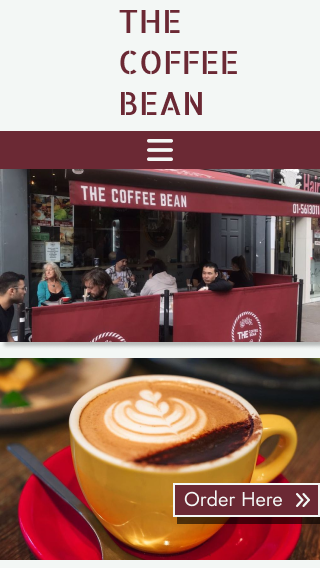
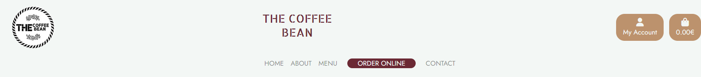
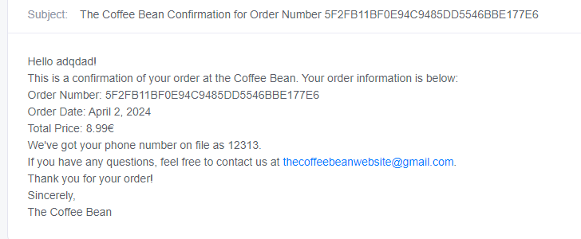

# The Coffee Bean PP5

[(Developer: Tanguy L'Alexandre)](https://github.com/tlalexandre)

[Link to deployed site](https://the-coffee-bean-1b1bc662dda4.herokuapp.com/)

<hr>
The Coffee Bean is an online ordering platform for a local coffee shop. Built using Python, Django, HTML, CSS, JavaScript, Amazon S3 and Stripe.


# Table Of Content

- [User Experience](#user-experience)
  - [User Stories](#user-stories)
  - [Site Goals](#site-goals)
  - [Scope](#scope)
- [Design](#design)
  - [Colour Scheme](#colour-scheme)
  - [Database Schema](#database-schema)
  - [Models](#models)
  - [Fonts](#fonts)
  - [Wireframes](#wireframes)
  - [Agile Methodology](#agile-methodology)
    - [Overview](#overview)
    - [EPICS(Milestones)](#epics---milestones)
    - [User Stories Issues](#user-stories---issues)
    - [GitHub Projects](#github-projectskanban)
- [Features](#features)
  - [Navigation Header](#navigation-header)
  - [Footer](#footer)
  - [Home Page](#home-page)
  - [Order Online Page](#products-page)
  - [Add/Edit Products Page](#add/edit-products-page)
  - [Item Detail Page](#item-detail-page)
  - [Cart Page](#cart-page)
  - [Checkout Page](#checkout-page)
  - [Confirmation Page](#confirmation-page)
  - [Profile Page](#profile-page)
  - [Sign In Page](#sign-in-page)
  - [Sign Up Page](#sign-up-page)
  - [Sign Out Page](#sign-out-page)
  - [Newsletter](#newsletter)
  - [Notification Messages](#notification-messages)
  - [Email Verification](#email-verification)
  - [Order Confirmation Email](#order-confirmation-email)
  - [Error Pages](#error-pages)
  - [Future Features](#future-features)
- [Marketing](#marketing)
  - [Initial Plan](#initial-plan)
  - [Paid Business Plan](#paid-business-plan)
- [Search Engine Optimization SEO](#search-engine-optimization-seo)
- [Testing](#testing)
- [Technologies and Languages](#technologies-and-languages)
  - [Languages](#languages-used)
  - [Python Modules](#python-modules-imported)
  - [Technologies and programs](#technologies-and-programs)
- [Deployment](#deployment)
  - [Pre Deployment](#pre-deployment)
    - [Stripe Setup](#stripe-setup)
    - [AWS Setup](#aws-setup)
  - [Deployment on Heroku](#deployment-on-heroku)
  - [Fork the Repository](#fork-the-repository)
  - [Clone the Repository](#clone-the-repository)
  - [Run the Repository Locally](#run-the-repository-locally)
- [Credits](#credits)
  - [Content](#content)
  - [Media](#media)
  - [Code](#code)
  - [Acknowledgements](#acknowledgements)

## User Experience

### User Stories

1. As a User, I can register for an account, log in, and log out, so that I can securely access and manage my account information and use the website's features. [#2](https://github.com/tlalexandre/PP5CodeInsitute/issues/2)
2. As an Admin User, I can add, edit, and remove menu items, categorize items, and customize item details, so that I can maintain an up-to-date and organized menu for customers to browse and order from. [#3](https://github.com/tlalexandre/PP5CodeInsitute/issues/3)
3. As a User, I can view the menu, add items to my cart, place an order, and track its status, while as an Admin User, I can view and manage orders, and communicate with customers, so that both users can efficiently navigate the ordering process and ensure timely delivery of orders. [#4](https://github.com/tlalexandre/PP5CodeInsitute/issues/4)
4. As an Admin User, I can manage user accounts, including creating new accounts, updating user information, and handling account-related requests, so that I can maintain user data integrity and provide assistance as needed. [#5](https://github.com/tlalexandre/PP5CodeInsitute/issues/5)
5. As a User, I can provide feedback or inquiries through the website, while as an Admin User, I can view and respond to user feedback, so that both users can engage in meaningful communication and address any concerns or questions effectively. [#6](https://github.com/tlalexandre/PP5CodeInsitute/issues/6)
6. As an Admin User, I can configure website settings and preferences, generate reports and analytics, and make data-driven decisions to optimize business operations and enhance the user experience, so that I can customize the website to meet the specific needs of the coffee shop and its customers. [#7](https://github.com/tlalexandre/PP5CodeInsitute/issues/7)
7. As a Site User, I can view the menu of the coffee shop to decide what items I want to order. [#8](https://github.com/tlalexandre/PP5CodeInsitute/issues/8)
8. As a Site User, I can register for an account to save my information and track my order history. [#9](https://github.com/tlalexandre/PP5CodeInsitute/issues/9)
9. As a Site User, I can log in to my account to access my saved information and previous orders. [#10](https://github.com/tlalexandre/PP5CodeInsitute/issues/10)
10. As a Site User, I can add items to my shopping cart to review and proceed to checkout later. [#11](https://github.com/tlalexandre/PP5CodeInsitute/issues/11)
11. As a Site User, I can view my shopping cart to modify quantities or remove items before finalizing my order. [#12](https://github.com/tlalexandre/PP5CodeInsitute/issues/12)
12. As a Site User, I can place an order to have my selected items prepared for pickup or delivery. [#13](https://github.com/tlalexandre/PP5CodeInsitute/issues/13)
13. As a Site User, I can provide payment information to complete my order and make a secure online payment. [#14](https://github.com/tlalexandre/PP5CodeInsitute/issues/14)
14. As a Site User, I can view my order history to track previous purchases and reorder items easily. [#15](https://github.com/tlalexandre/PP5CodeInsitute/issues/15)
15. As a Site User, I can receive notifications about the status of my order to stay informed about its progress and estimated delivery/pickup time. [#16](https://github.com/tlalexandre/PP5CodeInsitute/issues/16)
16. As a Site User, I can contact customer support to get assistance with any issues or inquiries regarding my orders or the website. [#17](https://github.com/tlalexandre/PP5CodeInsitute/issues/17)
17. As an Admin User, I can log in to the admin dashboard to access administrative functionalities and manage the website. [#18](https://github.com/tlalexandre/PP5CodeInsitute/issues/18)
18. As an Admin User, I can view a summary of recent orders to quickly assess the current state of order processing. [#19](https://github.com/tlalexandre/PP5CodeInsitute/issues/19)
19. As an Admin User, I can view detailed information about each order, including items ordered, customer details, and order status, to efficiently manage order fulfillment. [#20](https://github.com/tlalexandre/PP5CodeInsitute/issues/20)
20. As an Admin User, I can update the status of orders (e.g., processing, completed, cancelled) to track the progress of orders and communicate with customers as needed. [#21](https://github.com/tlalexandre/PP5CodeInsitute/issues/21)
21. As an Admin User, I can manage menu items, including adding new items, editing existing items, and removing items, to keep the menu up-to-date and reflective of available offerings. [#22](https://github.com/tlalexandre/PP5CodeInsitute/issues/22)
22. As an Admin User, I can categorize menu items into different categories (e.g., drinks, pastries) to organize the menu for easier navigation and browsing by customers. [#23](https://github.com/tlalexandre/PP5CodeInsitute/issues/23)
23. As an Admin User, I can view and respond to customer feedback or inquiries submitted through the website to address customer concerns and provide assistance as needed. [#24](https://github.com/tlalexandre/PP5CodeInsitute/issues/24)
24. As an Admin User, I can manage user accounts, including creating new accounts, updating user information, and deactivating accounts if necessary, to maintain user data integrity and security. [#25](https://github.com/tlalexandre/PP5CodeInsitute/issues/25)
25. As an Admin User, I can configure website settings and preferences (e.g., tax rates, delivery options) to customize the website to suit the needs of the coffee shop. [#26](https://github.com/tlalexandre/PP5CodeInsitute/issues/26)
26. As a User, I can navigate easily through the website , thanks to a consistent colour theme. [#37](https://github.com/tlalexandre/PP5CodeInsitute/issues/37)
27. As a Developer, I can lay out wireframes so that I can have a clear idea of the site's structure and theme. [#38](https://github.com/tlalexandre/PP5CodeInsitute/issues/38)
28. As a Developer , I want to ensure the styling and theme of the website are consistent with intuitive UI/UX so that users can easily digest content and perform all actions with ease. [#39](https://github.com/tlalexandre/PP5CodeInsitute/issues/39)

### Site Goals

1. Allowing users to order their food easily and make the process easier.
2. Allow users to contact the restaurant easily.
3. Provide information to users about their local coffee shop.
4. Encourage community engagement and interaction to build a strong community around the coffee shop.

### Scope

The project is axed around an online platform for this local coffee shop. Users can shop for a large variety of items available in the coffee shop. The Coffee Bean aims for user-friendliness, accessibility, and enjoyment. It ensuring a smooth experience for both shoppers and staff members.  The platform will encompass the following key features:

1. [EPIC - Website Configuration](https://github.com/tlalexandre/PP5CodeInsitute/issues/7)

   - Developers can configure website settings and preferences.

   - Database and media storage will be connected to ensure data storage and retrieval.


2. [EPIC - Authentification Management](https://github.com/tlalexandre/PP5CodeInsitute/issues/2) 

   - Users can register for an account, log in and log out so that they can securely access and manage their account information, and retrieve their orders.

3. [EPIC - Menu Management](https://github.com/tlalexandre/PP5CodeInsitute/issues/3)

   - Staff members can add , edit and remove menu items.

   - The menu items are separated in categories, to maintain an up-to-date and organized menu.

4. [EPIC - Order Management](https://github.com/tlalexandre/PP5CodeInsitute/issues/4)

   - Users can view the menu 
   - Users can add items to their cart, and retrieve them later.
   - Staff members can view orders, and communicate with customers.

5. [EPIC- User Account Management](https://github.com/tlalexandre/PP5CodeInsitute/issues/5)

   - Staff members can manage users accounts , update user informations and handle account-related requests.

6. [EPIC- Feedback and Communication](https://github.com/tlalexandre/PP5CodeInsitute/issues/6)

   - Users can provide feedback or inquires through the website via the contact form. 
   - Staff members can view users feedback and respond to it. 

## Design

The primary design goal of the CI Swag was to focus on clear categorization of menu items.

The primary objective of our website design was to ensure an incredibly user-friendly and efficient navigation experience. This was achieved through an intuitive filtering system of menu items, rendering of related items, and a responsive and clean navigation menu. Links in various areas of pages also provide return navigation options.

I wanted a clear separation between authenticated users and non-authenticated users. Users can access more content if authenticated and can view order history and update fields.

I wanted the design to be consistant though each page to have a unique feel to it. This was acheived through resuable component cards and a consistancy of colour, buttons, forms and other UI elements. I want the user to feel as if using the website was a fun and engaging experience as if browsing a shop in person.

This commitment to intuitive navigation and user-focused design principles remained at the forefront of project's development.

In order to enhance development style I researched different styling options and decided to take a strong inspiration from Deliveroo .

### Colour Scheme

The website colour theme mimics The Coffee Bean colour theme. The use of red, black, white and grey are the primary colours to help mimic the feel. Action components such as checkout, pay now or update forms are clearly distinguished by using the primary colour of the website.


### Database Schema


### Models

#### Allauth User Model

The User model is an integral component of Django Allauth, featuring pre-established fields as part of its standard configuration. Among these fields are username, email, name, password, and others. This model primarily serves the purpose of user authentication, which is why it is not recommended to make direct alterations to it. Furthermore, the User model is linked to the Profile model through a one-to-one relationship, facilitating the management of user-specific data and interactions.

#### Profile Model

Profile Model: The Profile Model provides a snapshot of each user's presence on the platform, encapsulating their user information, delivery information and order history. It is has a one to one relationship with the auth User Model.

#### MenuCategory Model

The Category Model categorises products and programs, ensuring users can easily discover relatable products/programs.

#### MenuItem Model

The MenuItem Model is one of the main models of the application . It includes category, image, price, name, description, sku, ingredients, included items and rating.

#### MenuItemIngredient Model

The MenuItemIngredient model creates the relationship between the MenuItem and the Ingredient model, allowing to set a different price for an Ingredient depending on which MenuItem it's associated with.

#### IngredientOption Model

The IngredientOption model allows to group ingredients that are related in groups to allow users to pick one of the ingredients as an option between several ingredients.(Example: All plant based milks are grouped together, and the user can choose only one of them for their drinks.)

#### MenuItemIncludedItem Model

The MenuItemIncludedItem model allows for certain items to be included as a choice inside another item and set a certain price for the item, different from the price of the item on its own. (Example: In the Full Irish Breakfast, the user gets to choose an included drink and the price will vary depending on the drink you'll take.)

#### Order Model

The Order model contains information about a purchase. It contains lineitems of MenuItem. 

#### OrderLine Item

The Order Line Item model is linked to the Order Model. Its fields are an FK to an order, menu_item, included_item, included_item_options, included_item_extras, options, extras, item_price, quantity and lineitem_total.

#### Cart

The Cart model allows to save the user cart in the database, with it's id and the items it contains, to be able to retrieve it easily during the checkout process , and with the webhook handler.


### Fonts

The fonts used in this project are Allerta and Jost, which give a welcoming and clear experience while mimicking the existing design of the coffee shop. <br>


### Wireframes

#### Desktop

<details><summary>Home</summary>

</details>
<details><summary>Order Online</summary>

</details>
<details><summary>Item Detail</summary>

</details>
<details><summary>Cart</summary>

</details>
<details><summary>Checkout Success</summary>

</details>
<details><summary>Profile</summary>

</details>


#### Mobile

<details><summary>Home</summary>

</details>
<details><summary>Order Online</summary>

</details>
<details><summary>Item Detail</summary>

</details>
<details><summary>Cart</summary>

</details>
<details><summary>Checkout Success</summary>

</details>
<details><summary>Profile</summary>

</details>


### Agile Methodology

#### Overview

This project adhered to agile principles, allowing for the meticulous planning of website features through the creation of user stories. Each story included specific acceptance criteria and tasks, facilitating clear objectives. Grouping these stories into EPIC milestones enabled a focused approach to addressing key elements of the site, ensuring necessary prerequisites were distinctly outlined for successful implementation.

#### EPICS - Milestones

In the Agile methodology framework, user stories are categorized into eight EPICs or Milestones. Moreover, an additional set of Milestones, referred to as Error Handling, was established specifically to address any errors encountered during testing, development, or optimization of site elements with refined code or enhancements.


#### User Stories - Issues

The user story issue format includes the user story, acceptance criteria, and tasks, detailing essential steps for issue resolution. Whenever feasible, commit messages are linked to their respective issues during development, ensuring the significance of each commit and visually tracking progress on project issues. Milestones, Kanban boards, and other Agile tools are employed to monitor these issues effectively.

<details><summary>User Story</summary>

</details>


#### GitHub Projects/Kanban

The project implemented a simple Kanban Board structure, comprising columns like Todo, In Progress, and Done. This arrangement offered a well-organised method for monitoring task progress, facilitating visualising and managing the workflow during development. The GitHub project Kanban was linked to the repository for consistent reference.

<details><summary>Kanban</summary>

</details>


## Features

### Navigation Header

The navigation bar is a consistent element across all pages, designed using Bootstrap and optimised for full responsiveness. The left is centered around navigation of content while the right hand side is related to user authentication. Authenticated users can also see create posts and view profile links while unauthenticated users only see a prompt to login/register.

The mobile version of the navbar has all the content rendered when a hamburger icon is clicked. When clicked a dropdown display is rendered showing all navigation links.

<details><summary>Navbar</summary>

</details>

<details><summary>Mobile</summary>

</details>

### Footer

The footer contains all the contact informtion about the website as well as the copywrite of trademark. It links to the socials as well as developers contact email. The privacy policy is also linked here

<details><summary>Footer</summary>

</details>

### Home Page

The homepage is used to welcome users to the website. 
It contains a picture of the actual coffee shop and a picture of a coffee, as well as a short description of the coffee shop.

<details><summary>Home</summary>

</details>

### Order Online Page

The order online page showcases preview cards of various menu items, each accompanied by basic list of the ingredients and images, offering users a quick overview of available items. A filtering system based on categories so users can refine their search to find desired products. 

<details><summary>Order Online</summary>

</details>


### Add/Edit Products Page

The Add/Edit products page displays a simple form where admins can add products to the database. Exisiting products can be edited or deleted. This gives business owners the ability to adjust prices, images, sales and other fields so as to keep an up to date inventory and business model.

<details><summary>Add/Edit Products</summary>

</details>


### Item Detail Page

The product detail page contains information about the selected product, including price, ingredients, the different options and extras for that product, as well as the included items if the item has some. Whenever the user selects an included item, the options and extras for this included item are retrieved from the database, allowing the user to customize fully the product.  Depending on which options, extras and included items the user selects, the price displayed in the Add to Cart button changes to let the user know how much the product is gonna be. Featuring an image of the product, users can view it before making a purchase decision.  With the option to adjust the quantity and an "Add to Cart" button where users can update their cart with a product quantity.

<details><summary>Product Detail</summary>

</details>


### Cart Page

The cart page displays a summary of the items currently in the user's cart, presenting essential information such as product details, quantities, the original price, the actual price of the item with the different options, extras, and included items. Additionally, users can view the total cost of all items on the cart button. 

Users can also update or delete items from their cart.

This page serves as a hub for users to review and manage their selected items before proceeding to checkout.

<details><summary>Cart</summary>

</details>


### Checkout Page

The checkout page streamlines the purchasing process, guiding users through the final steps of completing their orders. Users can review their selected items, input shipping and payment information. Users can add email changes and name changes for orders, but this will only affect a singler purpose. The checkout page provides order summary details, ensuring transparency regarding the total cost. Stripe payment elements are used to handle the payment processing.

<details><summary>Checkout</summary>

</details>


### Confirmation Page

The thank you and order confirmation page serves as a final acknowledgment of the user's completed purchase, expressing gratitude for their patronage. It provides a summary of the order details, including items purchased and total cost. Additionally, users may receive confirmation numbers or order IDs for reference. This page also serves as the order history page so users can review all orders they have purchased.

<details><summary>Confirmation</summary>

</details>


### Profile Page

The profile page is where users can easily update their user details such as edit delivery information. Users can access an overview of their past orders, allowing them to track their purchase history and review previous transactions.

<details><summary>Profile</summary>

</details>

### Sign In page

This page comprises a form with fields for entering a username and password. Beneath the form is the sign up button which submits the form. Below the form is a redirect to the register page if the user does not have an account. Click the remember me checkbox to remain logged in as a session.

<details><summary>Sign In</summary>

</details>


### Sign Up page

It features a form with fields for inputting name, email, username, password, and password confirmation. Underneath the form, there is a link to log in for users with existing accounts, followed by the signup button. After signup, users receive a welcome email at the provided email address and are then directed to the home page.

<details><summary>Sign Up</summary>

</details>


### Sign out page

Upon clicking the "log out" link in the navigation, users are directed to a confirmation page. This page includes a cautionary message and a button for logging out.

<details><summary>Sign Out</summary>

</details>


### Newsletter

An area where users can input there email to sign up to a newsletter. Users dont have to be authenticated to signup to the newsletter

<details><summary>Newsletter</summary>

</details>

### Notification Messages

Notification messages were user every time the user performs CRUD operation, sign in, and sign out.

<details><summary>Notifications</summary>

</details>


### Email Verification

An email is sent to a users selected email address on sign up requesting the verification of that email

<details><summary>Email Verification</summary>

</details>

### Order Confirmation Email

An email is sent to both authnetication and non authenticated users upon the completion of a successful purchase from the store

<details><summary>Order Confirmation Email</summary>

</details>

### Error Pages

Custom Error pages are rendered to show the user what went wrong with their request. These error pages allow the user to redirect to the home page.

An Example below is the 404 page

<details><summary>400</summary>

</details>


## Future Features

### Reordering same items

Allowing users to buy again their previous cart, to facilitate their use of the website.

### Print orders in shop

Automatically print orders of customers in shop, to allow the owner to check on customers orders the easiest way possible.

## Marketing

The B2C (Business-to-Consumer) ecommerce model is adopted for The Coffee Bean as it is an online  platform for this local coffee shop catering to individual consumers looking to purchase their food and coffee products.

The main target audience will be local consumers as well as tourists.

The Coffee Bean's marketing strategy will focus on online channels to boost traffic and engagement. There will be an initial setup as seen in this project followed by the hypothesis of a marketing strategy that can be used when payments/business accounts are installed.

### Initial Plan

Facebook will serve as the primary platform, with a dedicated business page promoting products and fostering customer interaction. Posts will be made on the business page as well as information pertaining to the website.

Additionally, Mailchimp will be utilized for weekly newsletters, updating subscribers on new offerings, promotions, and site enhancements.

By combining social media outreach with targeted email marketing, The Coffee Bean aims to effectively engage its audience, drive website traffic, and enhance brand visibility in the competitive coffee shop landscape.


### Paid Business Plan

Hypothesis is of a marketing plan for paid business. This will be broken down into 3 keys online providers. This will required GDPR considerations as well as a verified business.

#### Facebook

1. Boosted posts on the business homepage to extend reach
2. Installation of FB pixel throughout the website to capture analytics - CTR - Add To Cart, Purchase
3. Targeted add campaigns based on audience demographics and LLA audience modelling

#### Instagram

1. Reels and Shorts created to showcase products and testimonials
2. Linked to FB pixel for tracking performance metrics

### Google

1. Creating a google business account and updating business directory
2. Google ads for targeting audiences with banner ads and promoted search results
3. Analytics for understanding traffic and audience
4. Installing pixel throughout the website for key metrics

## Search Engine Optimization SEO

1. Descriptive meta tags were added to the main template, including title, description and keywords.
2. A sitemap was generated using [xml-sitemaps](https://www.xml-sitemaps.com/) This was generated using the deployed website. The file is included in the root level of the project.
3. Robots.txt file was created at the root level of the project. This file tells the search engine crawlers which URLs they can access on the website.

Future creation of a Google business account will improve SEO performance and website ratings.

## Testing

In depth testing documentation can be found [here.](./TESTING.md)

## Technologies And Languages

### Languages Used

- HTML
- CSS
- JavaScript
- JQuery
- Bootstrap
- Python
- Django

### Python Modules Imported

[Django-allauth](https://pypi.org/project/django-allauth/) is a versatile authentication and account management package for Django, providing a comprehensive set of features for user registration, authentication, account management, and social account integration.

[Dj-database-url](https://pypi.org/project/dj-database-url/) is used to parse the database URL specified in the DATABASE_URL environment variable, which is commonly used for configuring database connections in Django projects.

[Gunicorn](https://pypi.org/project/gunicorn/) is a popular WSGI (Web Server Gateway Interface) HTTP server for running Python web applications, including Django applications, in a production environment.

[Psycopg2](https://pypi.org/project/psycopg2/) is a PostgreSQL adapter for Python. It allows Django to connect to PostgreSQL databases.

[Django Crispy Forms](https://pypi.org/project/django-crispy-forms/) is a Django application that enhances the presentation and customization of Django forms, making it easier to create aesthetically pleasing and responsive forms for web applications.

[Boto3](https://pypi.org/project/boto3/) is the Amazon Web Services (AWS) SDK for Python. It allows to interact with AWS services, such as S3 storage for media/static files

[Pillow](https://pypi.org/project/pillow/) is a Python Imaging Library (PIL) fork that provides tools for working with images in various formats.

[Django Storages](https://pypi.org/project/django-storages/) Django Storages simplifies file storage management in Django apps by offering custom backends.

[Django Embed Video](https://pypi.org/project/django-embed-video/) Django-embed-video is a Django app that simplifies embedding videos from various platforms, such as YouTube and Vimeo, into Django templates by providing template tags and model fields.

[Stripe](https://pypi.org/project/stripe/) Stripe is a payment processing platform that enables payments by offering a developer-friendly API and a range of customizable payment solutions.

### Technologies and programs

- [Bootstrap](https://getbootstrap.com/) was used to quickly layout the responsive structure of the website
- [JQuery](https://jquery.com/) was used to apply all javascript functionality in a more efficient manner
- [Chat-GPT](https://chat.openai.com/) was used to create all written content and copy of the website
- [VS Code](https://code.visualstudio.com/) was used to code the website locally
- [Figma](https://figma.com/) was used to create quick and precise wireframes
- [Font Awesome](https://fontawesome.com/) was used for all icons on the website
- [GitHub](https://github.com/) is the hosting site used to store the code for the website.
- [Git](https://git-scm.com/) was used as a version control software to commit and push the code to the GitHub repository.
- [Google Chrome Lighthouse](https://developers.google.com/web/tools/lighthouse) was used for scoring the website during the testing phase
- [Google Chrome Developer Tools](https://developer.chrome.com/docs/devtools/overview/) was used during testing, debugging and making the website responsive.
- [W3C HTML Validator](https://validator.w3.org/) was used to check for errors in the HTML code.
- [W3C CSS Validator](https://jigsaw.w3.org/css-validator/) was used to check for errors in the CSS code
- [Wave Accessibility Tool](https://wave.webaim.org/) was used during testing to check accessibility
- [WebAim Contrast Checker](https://webaim.org/resources/contrastchecker/) was used to ensure proper contrast guidelines where adhered to.
- [Pylance Validator](https://marketplace.visualstudio.com/items?itemName=ms-python.vscode-pylance) was used as a linter to enhance best practice in the Python code.
- [CI Python Pep8 Checker](https://pep8ci.herokuapp.com/) was used to validate the Python code.
- [Stripe](https://stripe.com/) was used to handle all payment processing
- [AWS](https://aws.amazon.com/) was used host all static and media files for the site.
- [Coolors.co](https://coolors.co/) was used to display the colour scheme.
- [DBDiagram](https://dbdiagram.io/) was used to visually create the database structure and schemas
- [PostGresSQl](https://www.postgresql.org/) was used in development to store the database information locally
- [ElephantSQL](https://www.elephantsql.com/) was the database hosting provider for the production app
- [Heroku](https://heroku.com/) was the hosting provider used.

## Deployment

### Pre Deployment

To ensure the application is deployed correctly on Heroku it is mandatory to update the requirements.txt. This is a list of requirements that the application needs in order to run.

- To create the list of requirements we use the command pip3 freeze > requirements.txt. This will ensure the file with the requirements is updated.
- Then commit and push the changes to GitHub.

! Before pushing code to GitHub ensure all credentials are in an env.py file, which is included in the .gitignore file. This tells Git not to track this file which will prevent it from being added to Github and the credentials being exposed.

### Stripe setup

- Log in to [Stripe](https://stripe.com/en-ie)
- Navigate to developers section (link located at the top right)
- Go to API keys tab and copy the values of PUBLIC_KEY and SECRET_KEY and add them to your env.py file
- Navigate to the Webhooks page from the tab in the menu at the top and click on add endpoint.
- This section requires a link to the deployed application. The link should look like this https://your_website.herokuapp.com/checkout/wh/
- Choose the events the webhook should recieve and add endpoint.
- When the application is deployed, run a test transaction to ensure the webhooks are working. The events chan be checked in the webhooks page.

### AWS setup

- Log in to [AWS](https://aws.amazon.com/)

1. Create a new S3 bucket:

- Choose the closest AWS region.
- Add unique bucket name.
- Under Object Ownership select ACLs enabled to allow access to the objects in the bucket.
- Under Block Public Access settings unselect block all public access as the application will need access to the objects in the bucket.
- Click on create bucket.

2. Edit bucket settings.

- Bucket properties
  - Open the bucket page.
  - Go to properties tab and scroll down to website hosting and click on edit.
  - Enable static website hosting
  - Under the Hosting type section ensure Host a static website is selected.
  - Add Index.html to index document field and error.html to error document field and click save.
- Bucket permissions

  - Navigate and Click on the "Permissions" tab.
  - Scroll down to the "CORS configuration" section and click edit.
  - Enter the following snippet into the text box and click on save changes.

  ```
  [
  {
      "AllowedHeaders": [
          "Authorization"
      ],
      "AllowedMethods": [
          "GET"
      ],
      "AllowedOrigins": [
          "*"
      ],
      "ExposeHeaders": []
  }
  ]
  ```

  - Scroll to bucket policy section and click edit. Take note of the bucket arn (Example: arn:aws:s3:::test-bucket)
  - Click on policy generator and set the following settings:

    1. Select Type of Policy - S3 Bucket Policy
    2. Effect Allow
    3. Principal \*
    4. AWS Service Amazon S3
    5. Actions: GetObject
    6. Amazon arn: your arn from the previous page

  - Click on add statement and then generate policy.Copy the policy
  - Paste the policy into the bucket policy editor.
  - Add "/\*" to the end of the resource key to allow access to all resources in this bucket.
  - Navigate and Click Save changes.
  - For the Access control list (ACL) section, click edit and enable List for Everyone (public access) and accept the warning box. If the edit button is disabled, you need to change the Object Ownership section above to ACLs enabled (refer to Create Bucket section above).

3. Identify and Access Management (IAM)

- Create User group
  - In the search bar, search for IAM.
  - On the IAM page select user groups in the menu on the left.
  - Click on create user group, add a name and click create group. The users and permission policies will be added later.
- Create Permissions policy for the user group

  - Go to Policies in the left-hand menu and click create policy
  - Click on actions and import policy.
  - Search for "AmazonS3FullAccess", select this policy, and click "Import".
  - Click "JSON" under "Policy Document" to see the imported policy
  - Copy the bucket ARN from the bucket policy page and paste it into the "Resource" section of the JSON snippet. Be sure to remove the default value of the resource key ("_") and replace it with the bucket ARN.
    Copy the bucket ARN a second time into the "Resource" section of the JSON snippet. This time, add "/_" to the end of the ARN to allow access to all resources in this bucket.

  ```
      {
      "Version": "2012-10-17",
      "Statement": [
          {
              "Effect": "Allow",
              "Action": [
                  "s3:*",
                  "s3-object-lambda:*"
              ],
              "Resource": [
                  "arn:aws:s3:::your-project",
                  "arn:aws:s3:::your-project/*"
              ]
          }
      ]
  }

  ```

  - On the next page add polcity name and description and click create policy.

- Attach Policy to User Group

  - Click on User Groups in the left-hand menu.
  - Click on the user group name created during the above step and select the permissions tab.
  - Click Attach Policy.
  - Search for the policy created during the above step, select it and click attach policy.

- Create User
  - Click on Users in the left-hand menu and click on add user.
  - Enter a User name .
  - Select Programmatic access and AWS Management Console access and click next.
  - Click on add user to group, select the user group created earlier and click create user.
  - Take note of the Access key ID and Secret access key as these will be needed to connect to the S3 bucket.
  - To save a copy of the credentials click Download .csv

### Deployment on Heroku

- To deploy the project on Heroku, first create an account.
- Once logged in, create a new app by clicking on the create app button
- Pick a unique name for the app, select a region, and click Create App.
- On the next page select the settings tab and scroll down to Config Vars. If there are any files that should be hidden like credentials and API keys they should be added here. In this project, there are credentials that need to be protected. This project requires credentials added for:

        1. Django's secret key
        2. Database Credentials
        3. AWS access key
        3. AWS secret key
        4. Email host password.
        5. Stripe public key
        6. stripe secret key
        7. Stripe wh secret

- Scroll down to Buildpacks. The buildpacks will install further dependencies that are not included in the requirements.txt. For this project, the buildpack required is Python
- From the tab above select the deploy section.
- The deployment method for this project is GitHub. Once selected, confirm that we want to connect to GitHub, search for the repository name, and click connect to connect the Heroku app to our GitHub code.
- Scroll further down to the deploy section where automatic deploys can be enabled, which means that the app will update every time code is pushed to GitHub. Click deploy and wait for the app to be built. Once this is done, a message should appear letting us know that the app was successfully deployed with a view button to see the app.

### Fork the Repository

1. Navigate to the [repository](https://github.com/Dayana-N/Book-Heaven-PP5)
2. In the top-right corner of the page click on the fork button and select create a fork.
3. You can change the name of the fork and add description
4. Choose to copy only the main branch or all branches to the new fork.
5. Click Create a Fork. A repository should appear in your GitHub

### Clone the Repository

1. Navigate to the [repository](https://github.com/Dayana-N/Book-Heaven-PP5)
2. Click on the Code button on top of the repository and copy the link.
3. Open Git Bash and change the working directory to the location where you want the cloned directory.
4. Type git clone and then paste the link.
5. Press Enter to create your local clone.

### Run The Repository Locally

1. Go to the GitHub repository
2. Locate the green Code button above the list of files and click it
3. From the dropdown menu select download Zip.
4. Download and open the zip file to run in an editor
5. Create an env.py file and input the environment variables
6. Ensure [PostgreSQL](https://www.postgresql.org/) is install on your computer and ports are open
7. Create a virtual environment for installing the python modules in the pip file.
8. Run python3 makemigrations, migrate and runserver

## Credits

### Content

Additionaly copy for the website was prompted with use of [ChatGPT](https://chat.openai.com/)
For Readme/Testing templates inspiration and guidance from [BookHeaven](https://github.com/Dayana-N/Book-Heaven-PP5/blob/main/README.md)

### Media

All Media images on this website were created using [Leondardo AI](https://leonardo.ai/)
[Hero Image](https://www.linkedin.com/posts/melinda-zhang-2020_the-weekend-ended-with-a-blast-our-activity-6975486245997056001-W-_I/)
[Default Product Image](https://nayemdevs.com/changing-the-default-thumbnail-placeholder-of-woocommerce-product-is-easy/)
[Demo Course Video](https://www.youtube.com/watch?v=TjPFZaMe2yw&t=2s)

### Code

- Boutique Ado CI Walkthrough was used for the base of this project
- [Content Type Framework](https://docs.djangoproject.com/en/5.0/ref/contrib/contenttypes/)
- [Content Type Admin Crud](https://copyprogramming.com/howto/how-can-i-customize-the-display-of-a-model-using-contenttypes-in-the-admin)
- [Bootstrap Templates](https://startbootstrap.com/templates/ecommerce)
- [Local Stripe Webhook Testing](https://www.youtube.com/watch?v=q33qN2zz4E4&t=453s)
- [Basic Automated Tests](https://learndjango.com/tutorials/django-testing-tutorial)
- [Client Testing](https://docs.djangoproject.com/en/5.0/topics/testing/tools/)
- [Custom Template Tags](https://realpython.com/django-template-custom-tags-filters/#:~:text=Custom%20tags%20and%20filters%20live,to%20load%20the%20tag%20library.)

### Acknowledgements

I would personally like to thank all people who underwent testing for this website. The critial feedback was instrumental in providing a good user experience, finding edge case errors and generally keeping me motivated to improve the website. John Paul Larkin, Megan ODonohoe, Juan Boccia, Izabella Lopes, Gary Donlan, Alan Bushell and Dayana.

I would finally like to thank my mentor Antonio Rodriguez who helped identify critical issues and bugs along the way.
