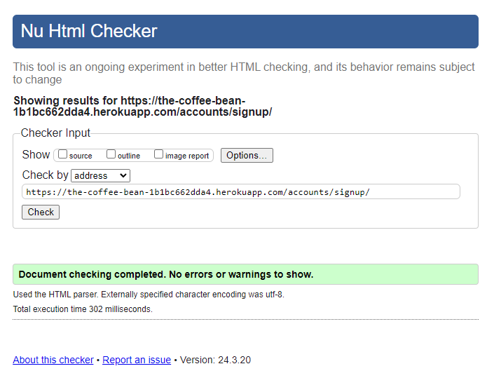
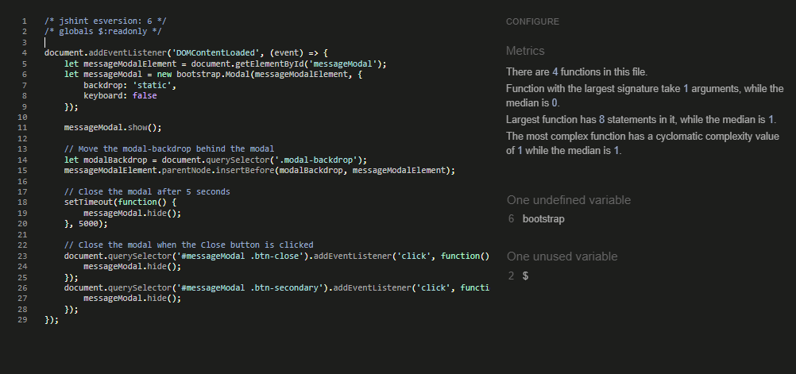
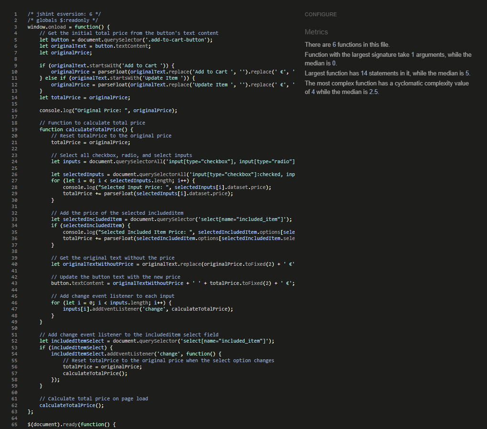
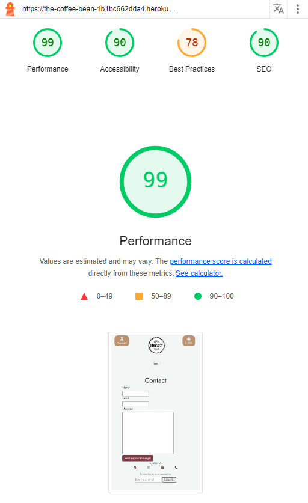
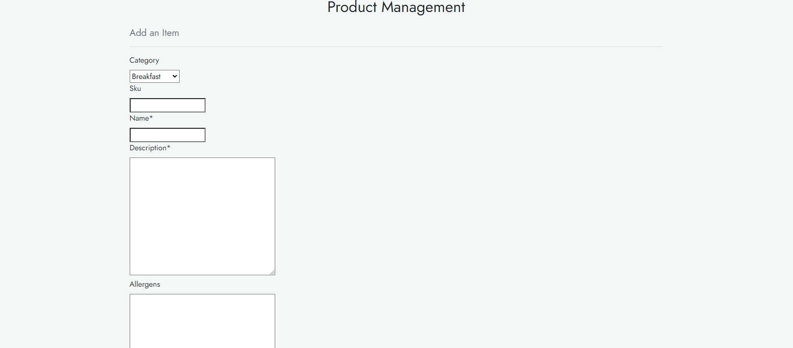
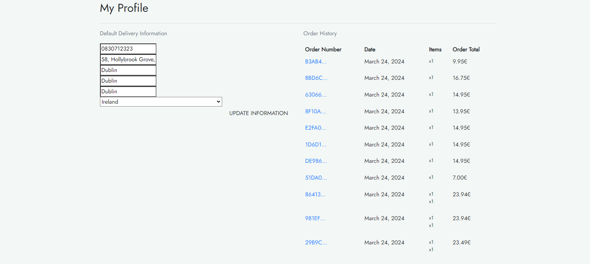
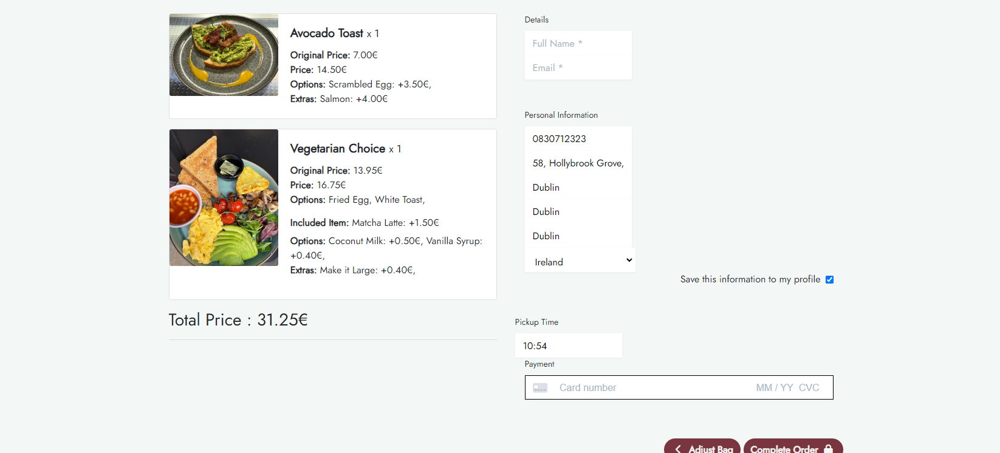
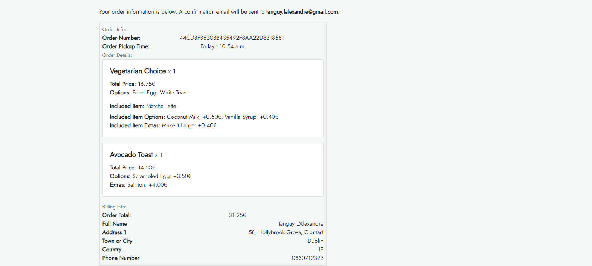
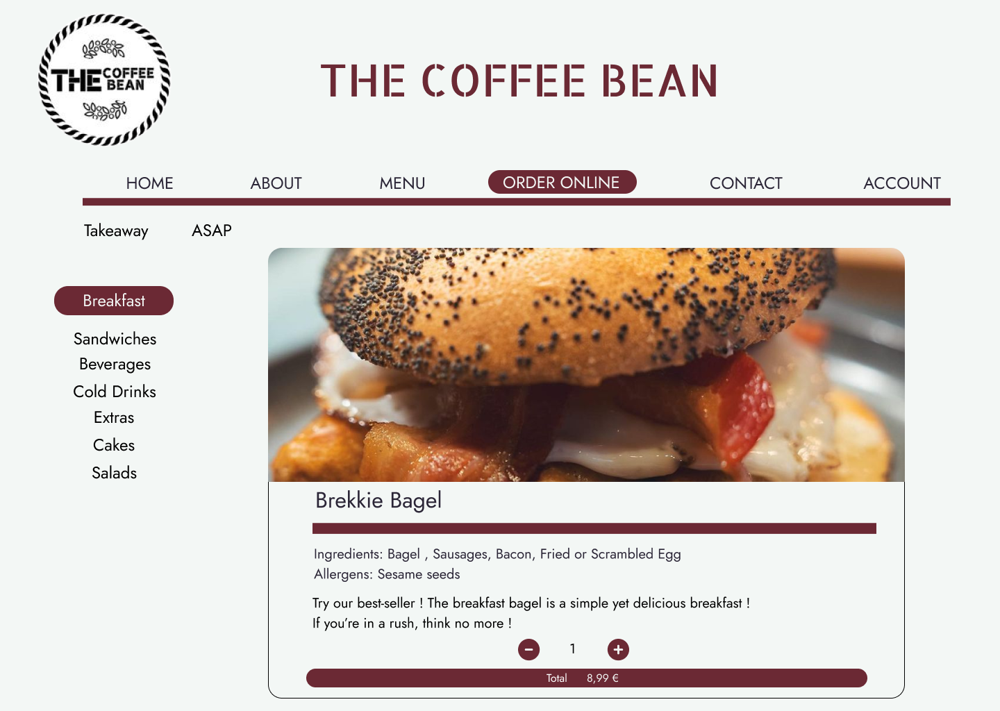

Go back to [README.md](/README.md)

# Testing

- [Code Validation](#code-validation)
  - [HTML](#html)
  - [CSS](#css)
  - [JavaScript](#JavaScript)
  - [Python](#python)
- [Responsiveness](#Responsiveness)
- [Browser Compatibility](#browser-compatibility)
- [Lighthouse](#Lighthouse)
- [CRUD](#crud)
- [Manual Testing](#manual-testing)
- [User Story Testing](#user-story-testing)
- [Stripe](#stripe)

## Code Validation

### HTML

| Page             | Validator                                                    | Result           | Comment |
| ---------------- | ------------------------------------------------------------ | ---------------- | ------- |
| Home             |     | <mark>PASS<mark> |         |
| About            |    | <mark>PASS<mark> |         |
| Menu             |  | <mark>PASS<mark> |         |
| Order Online     |  | <mark>PASS<mark> |         |
| Item Detail      |  | <mark>PASS<mark> |         |
| Profile          |  | <mark>PASS<mark> |         |
| Cart             |         | <mark>PASS<mark> |         |
| Checkout         |  | <mark>PASS<mark> |         |
| Checkout Success |  | <mark>PASS<mark> |         |
| Add Item         |  | <mark>PASS<mark> |         |
| Edit Item        |  | <mark>PASS<mark> |         |
| Logout           |  | <mark>PASS<mark> |         |
| Login            |       | <mark>PASS<mark> |         |
| Register         |  | <mark>PASS<mark> |         |
| Errors           |        | <mark>PASS<mark> |         |
| Contact          |   | <mark>PASS<mark> |         |

### CSS

| File         | Validator                                                    | Result           |
| ------------ | ------------------------------------------------------------ | ---------------- |
| Base         |       | <mark>PASS<mark> |
| Cart         |    | <mark>PASS<mark> |
| Checkout     |  | <mark>PASS<mark> |
| Home         |    | <mark>PASS<mark> |
| Order Online |  | <mark>PASS<mark> |

## JavaScript

| File               | Validator                                                    | Result           | Comment                          |
| ------------------ | ------------------------------------------------------------ | ---------------- | -------------------------------- |
| stripe_elements.js |  | <mark>PASS<mark> | Global variables and es6 enabled |
| itemDetail.js      |  | <mark>PASS<mark> | Global variable errors           |
| modal.js           |       | <mark>PASS<mark> | Global variables and es6 enabled |
| orderonline.js     |  | <mark>PASS<mark> | Global variables and es6 enabled |
| pickupTime.js      |  | <mark>PASS<mark> | Global variables and es6 enabled |
| updatePrice.js     |  | <mark>PASS<mark> | Global variables and es6 enabled |

## Python

| File     | App         | Image                                                        | Result           | Comment |
| -------- | ----------- | ------------------------------------------------------------ | ---------------- | ------- |
| views    | home        |  | <mark>PASS<mark> |         |
| urls     | home        |  | <mark>PASS<mark> |         |
| forms    | home        |  | <mark>PASS<mark> |         |
| views    | orderonline |  | <mark>PASS<mark> |         |
| urls     | orderonline |  | <mark>PASS<mark> |         |
| models   | orderonline |  | <mark>PASS<mark> |         |
| admin    | orderonline |  | <mark>PASS<mark> |         |
| forms    | orderonline |  | <mark>PASS<mark> |         |
| widgets  | orderonline |  | <mark>PASS<mark> |         |
| views    | profiles    |  | <mark>PASS<mark> |         |
| urls     | profiles    |  | <mark>PASS<mark> |         |
| models   | profiles    |  | <mark>PASS<mark> |         |
| forms    | profiles    |  | <mark>PASS<mark> |         |
| webhooks | checkout    |  | <mark>PASS<mark> |         |
| handler  | checkout    |  | <mark>PASS<mark> |         |
| view     | checkout    |  | <mark>PASS<mark> |         |
| urls     | checkout    |  | <mark>PASS<mark> |         |
| signals  | checkout    |  | <mark>PASS<mark> |         |
| models   | checkout    |  | <mark>PASS<mark> |         |
| forms    | checkout    |  | <mark>PASS<mark> |         |
| admin    | checkout    |  | <mark>PASS<mark> |         |
| views    | cart        |  | <mark>PASS<mark> |         |
| urls     | cart        |  | <mark>PASS<mark> |         |
| context  | cart        |  | <mark>PASS<mark> |         |

## Responsiveness

The responsiveness of the website was thoroughly tested on various devices, including a desktop computer and a Google Pixel 6. Across all devices, the elements were displayed cleanly and were well-organized, ensuring a consistent and user-friendly experience.

## Browser Compatibility

| Browser       | Result                                                     | Pass/Fail         |
| ------------- | ---------------------------------------------------------- | ----------------- |
| Google Chrome | All pages, load as expected. All features work as expected | <mark>Pass</mark> |
| Firefox       | All pages, load as expected. All features work as expected | <mark>Pass</mark> |
| Edge          | All pages, load as expected. All features work as expected | <mark>Pass</mark> |
| Safari        | All pages, load as expected. All features work as expected | <mark>Pass</mark> |

## Lighthouse

| Page                    | Validator                                                    | Result                 |
| ----------------------- | ------------------------------------------------------------ | ---------------------- |
| Home                    |   | <mark>Excellent</mark> |
| Home Mobile             |  | <mark>Good</mark>      |
| Order Online            |  | <mark>Excellent</mark> |
| Order Online Mobile     |  | <mark>Pass</mark>      |
| Item Detail             |  | <mark>Excellent</mark> |
| Item Detail Mobile      |  | <mark>Good</mark>      |
| Add Product             |  | <mark>Excellent</mark> |
| Add Product Mobile      |  | <mark>Good</mark>      |
| About                   |  | <mark>Excellent</mark> |
| About Mobile            |  | <mark>Good</mark>      |
| Contact                 |  | <mark>Excellent</mark> |
| Contact Mobile          |  | <mark>Excellent</mark> |
| Menu                    |   | <mark>Good</mark>      |
| Menu Mobile             |  | <mark>Pass</mark>      |
| Cart                    |   | <mark>Excellent</mark> |
| Cart Mobile             |  | <mark>Good</mark>      |
| Checkout                |  | <mark>Good</mark>      |
| Checkout Mobile         |  | <mark>Pass</mark>      |
| Checkout Success        |  | <mark>Excellent</mark> |
| Checkout Success Mobile |  | <mark>Pass</mark>      |
| Sign In                 |  | <mark>Excellent</mark> |
| Sign In Mobile          |  | <mark>Good</mark>      |
| Sign Up                 |  | <mark>Excellent</mark> |
| Sign Up Mobile          |  | <mark>Good</mark>      |

Main issues that could not be resolved which drastically reduced the LCP and performance score was server delays from Heroku which impacted the first byte load.
After must research I could not find a solution to this issue. I will continue to try optimise and research best practices but for now I need further guidance.

## CRUD

The main crud functionality of this website pertains to user accounts and product purchases

### Create

1. Users can create accounts
2. Users can create cart items
3. Users can create orders
4. Admins and Moderators can create products

### Read

1. All items are read from DB
4. All user orders are read from DB
5. All user information is read from DB

### Update

1. Users can update cart items
5. Admins and Moderators can update products

### Delete

1. Users can remove items from cart
3. Admins and Moderators can delete products

## Manual Testing

### Site Navigation

| Element                  | Action  | Expected Result                                              | Pass/Fail         |
| ------------------------ | ------- | ------------------------------------------------------------ | ----------------- |
| Logo                     | Click   | Redirect to Home page                                        | <mark>Pass</mark> |
| Dropdown Button          | Click   | Render a dropdown menu of all different pages of the website | <mark>Pass</mark> |
| Dropdown Link            | Click   | Redirect to the selected page                                | <mark>Pass</mark> |
| Account Button           | Click   | Render a dropdown menu of all profile sections               | <mark>Pass</mark> |
| Account Dropdown         | Click   | Redirect to the selected page                                | <mark>Pass</mark> |
| Account Dropdown Link    | Click   | Redirect to the selected page                                | <mark>Pass</mark> |
| Profile Dropdown Auth    | Display | Render logout, profile, add product links                    | <mark>Pass</mark> |
| Profile Dropdown NonAuth | Click   | Render login and register links                              | <mark>Pass</mark> |
| Cart Icon Link           | Click   | Redirect to cart page                                        | <mark>Pass</mark> |
| Footer Socials           | Click   | Redirect in a new tab to all respective media platforms      | <mark>Pass</mark> |
| Footer Email             | Click   | Open up an email provider with developer email attached      | <mark>Pass</mark> |
| Newsletter Input Valid   | Submit  | User email logged in mailchimp                               | <mark>Pass</mark> |
| Newsletter Input Valid   | Submit  | User notified of success                                     | <mark>Pass</mark> |
| Newsletter Input Invalid | Submit  | Error context displayed to UI                                | <mark>Pass</mark> |
| Register Link            | Display | Render for non authenticated users                           | <mark>Pass</mark> |
| Log in Link              | Display | Render for non authenticated users                           | <mark>Pass</mark> |
| Log out Link             | Display | Render only if user is authenticated                         | <mark>Pass</mark> |
| Profile Link             | Display | Render only if user is authenticated                         | <mark>Pass</mark> |

### Order Online Page

| Element             | Action  | Expected Result                                             | Pass/Fail         |
| ------------------- | ------- | ----------------------------------------------------------- | ----------------- |
| Category Widgets    | Click   | Redirect to selected item category page                     | <mark>Pass</mark> |
| Current Category    | Display | Current displayed category is shown in the dedicated navbar | <mark>Pass</mark> |
| Item Cards          | Display | All Item Cards Rendered in grid layout                      | <mark>Pass</mark> |
| Item View Card Link | Click   | Redirect to item detail page                                | <mark>Pass</mark> |
| Item Edit Button    | Display | Only admins can see this button                             | <mark>Pass</mark> |
| Item Edit Button    | Click   | Redirect to edit item page                                  | <mark>Pass</mark> |
| Item Delete Button  | Display | Only admins can see this button                             | <mark>Pass<mark>  |

### Item Detail Page

| Element                    | Action  | Expected Result                                              | Pass/Fail         |
| -------------------------- | ------- | ------------------------------------------------------------ | ----------------- |
| Quantity Input             | Input   | Updates the total amount of desired product - no negative values | <mark>Pass</mark> |
| Add to Cart Button         | Click   | Total quantity of items added to cart                        | <mark>Pass</mark> |
| Add to Cart Button         | Click   | Notification appears upon the outcome of adding to the cart  | <mark>Pass</mark> |
| Item Edit Button           | Display | Only moderators and admins can see this button               | <mark>Pass</mark> |
| Item Edit Button           | Click   | Redirect to edit item page                                   | <mark>Pass</mark> |
| Back Link                  | Click   | Redirects back to the products page                          | <mark>Pass</mark> |
| Item options Radio input   | Click   | Select options for an item                                   | <mark>Pass<mark>  |
| Item extras checkboxes     | Click   | Select extras for an item                                    | <mark>Pass<mark>  |
| Included Item select input | Click   | Select the included item if the item has some                | <mark>Pass<mark>  |
| SideBar links              | Click   | Redirect user to the selected section of the order online page` | <mark>Pass<mark>  |

### Add Product Page

| Element        | Action  | Expected Result                                | Pass/Fail         |
| -------------- | ------- | ---------------------------------------------- | ----------------- |
| Authentication | Display | Only Moderators and Admins can access the page | <mark>Pass</mark> |
| Form           | Display | A form is rendered with all fields editable    | <mark>Pass</mark> |
| Form           | Display | Required fields are clearly marked             | <mark>Pass</mark> |
| Form Valid     | Submit  | A a product is saved to the database           | <mark>Pass</mark> |
| Form Valid     | Submit  | User is redirected to the products page        | <mark>Pass</mark> |
| Form Valid     | Submit  | A notification displays the success message    | <mark>Pass</mark> |
| Form Invalid   | Submit  | Error context is rendered to the UI            | <mark>Pass</mark> |
| Form Invalid   | Submit  | A notification display an error occured        | <mark>Pass</mark> |
| Form Invalid   | Submit  | User is redirected to the add product page     | <mark>Pass</mark> |
| Products Link  | Click   | Navigate to products page                      | <mark>Pass</mark> |

### Edit Product Page

| Element             | Action  | Expected Result                                           | Pass/Fail         |
| ------------------- | ------- | --------------------------------------------------------- | ----------------- |
| Tests Add Products  | All     | All validation and display context from add products pass | <mark>Pass</mark> |
| Form                | Display | Product data is pre rendered to the page                  | <mark>Pass</mark> |
| Form                | Display | Product data is pre rendered to the page                  | <mark>Pass</mark> |
| Current Image       | Display | Link to current image displayed                           | <mark>Pass</mark> |
| Current Image Clear | Checked | Image is removed from the product                         | <mark>Pass</mark> |
| Current Image Clear | Checked | Image is removed from the product                         | <mark>Pass</mark> |
| Form Update Button  | Click   | Form is submitted                                         | <mark>Pass</mark> |
| Form Delete Button  | Click   | Confirmation modal appears                                | <mark>Pass</mark> |
| Modal Delete Button | Click   | Product is removed from the database                      | <mark>Pass</mark> |
| Modal Delete Button | Click   | User is redirected to the products page                   | <mark>Pass</mark> |
| Modal Delete Button | Click   | A notification message is displayed to user               | <mark>Pass</mark> |
| Modal Cancel Button | Click   | Modal is hidden                                           | <mark>Pass</mark> |
| Products Link       | Click   | Navigate to products page                                 | <mark>Pass</mark> |

### Cart Page

| Element                  | Action | Expected Result                                              | Pass/Fail         |
| ------------------------ | ------ | ------------------------------------------------------------ | ----------------- |
| Update Button            | Click  | Redirect the user to an update page with prefilled informations | <mark>Pass</mark> |
| Delete Button            | Click  | Delete all quantity of selected item from cart               | <mark>Pass</mark> |
| Add / Remove Cart Button | Click  | Notification appears upon outcome of adding/removing from cart | <mark>Pass</mark> |
| Checkout Button          | Click  | Redirects to checkout page                                   | <mark>Pass</mark> |

### Checkout Page

| Element                    | Action  | Expected Result                                              | Pass/Fail         |
| -------------------------- | ------- | ------------------------------------------------------------ | ----------------- |
| Checkout No Items          | Display | Redirect to cart page with notification                      | <mark>Pass</mark> |
| Checkout Form              | Submit  | Checkout form submit user and delivery data to stripe        | <mark>Pass</mark> |
| Checkout Form              | Submit  | Stripe payment intent, charge and succeeded occurs           | <mark>Pass</mark> |
| Checkout Form              | Submit  | Non valid form returns context of errors                     | <mark>Pass</mark> |
| Checkout Form              | Submit  | Successful order redirects to checkout success page          | <mark>Pass</mark> |
| Checkout Form              | Submit  | Stripe webhooks are logged via stripe listeners              | <mark>Pass</mark> |
| Checkout Form Save Details | Submit  | Authenticated users details are saved if the button is checked | <mark>Pass</mark> |
| Stripe Payment Element     | Submit  | Stripe payment element renders error context if not valid    | <mark>Pass</mark> |
| Complete Order Button      | Click   | Submits user/delivery/payment information                    | <mark>Pass</mark> |
| Remove from Cart Button    | Click   | Removes all quantity of selected items from the cart         | <mark>Pass</mark> |
| Loading Coffee Cup         | Display | A coffee cup is displayed when awaiting payment results      | <mark>Pass</mark> |
| Cart Items                 | Display | All Cart items are displayed with a price breakdown          | <mark>Pass</mark> |
| Total Cost                 | Display | The total cost is accounted for a price breakdown            | <mark>Pass</mark> |

### Checkout Success/ Past Order Page

| Element       | Action  | Expected Result                                                     | Pass/Fail         |
| ------------- | ------- | ------------------------------------------------------------------- | ----------------- |
| Checkout Form | Display | Checkout form rendered all Order information, price, user, delivery | <mark>Pass</mark> |
| Checkout Form | Display | Total cost breakdown is displayed for the user                      | <mark>Pass</mark> |
| Notification  | Display | A Notification appears highlighting the successful order number     | <mark>Pass</mark> |

### Profile Page

| Element               | Action  | Expected Result                                              | Pass/Fail         |
| --------------------- | ------- | ------------------------------------------------------------ | ----------------- |
| User Form             | Submit  | A valid user form updates the users first/last name and username | <mark>Pass</mark> |
| User Form             | Submit  | Non valid form returns the context of the error              | <mark>Pass</mark> |
| User Notification     | Submit  | A Notification appears highlighting outcome of form submission | <mark>Pass</mark> |
| Checkout Form         | Display | Total cost breakdown is displayed for the user               | <mark>Pass</mark> |
| Update Profile Button | Click   | Submits the user form                                        | <mark>Pass</mark> |
| Past Order Link       | Click   | Redirects the user to the checkout success page / past order | <mark>Pass</mark> |
| Past Orders           | Display | Renders all authenticated users past orders                  | <mark>Pass</mark> |

### Sign Up Page

| Element       | Action         | Expected Result                             | Pass/Fail         |
| ------------- | -------------- | ------------------------------------------- | ----------------- |
| Page          | Authentication | Authenticated users redirected to Home page | <mark>Pass</mark> |
| Form(Valid)   | Submit         | Redirected to Home page                     | <mark>Pass</mark> |
| Form(Valid)   | Submit         | Sign up in Notification received            | <mark>Pass</mark> |
| Form(Invalid) | Submit         | Error Context rendered to UI                | <mark>Pass</mark> |
| Form(Invalid) | Submit         | Error Notification received                 | <mark>Pass</mark> |
| Login Link    | Click          | Redirect to Login Page                      | <mark>Pass</mark> |

### Sign In Page

| Element       | Action         | Expected Result                             | Pass/Fail         |
| ------------- | -------------- | ------------------------------------------- | ----------------- |
| Page          | Authentication | Authenticated users redirected to Home page | <mark>Pass</mark> |
| Form(Valid)   | Submit         | Redirected to Home page                     | <mark>Pass</mark> |
| Form(Valid)   | Submit         | Sign up in Notification received            | <mark>Pass</mark> |
| Form(Invalid) | Submit         | Error Context rendered to UI                | <mark>Pass</mark> |
| Form(Invalid) | Submit         | Error Notification received                 | <mark>Pass</mark> |
| Register Link | Click          | Redirect to Sign In Page                    | <mark>Pass</mark> |

### Log Out Page

| Element       | Action         | Expected Result                                | Pass/Fail         |
| ------------- | -------------- | ---------------------------------------------- | ----------------- |
| Page          | Authentication | Un-authenticated users redirected to Home page | <mark>Pass</mark> |
| Logout Button | Click          | User session is Logged out                     | <mark>Pass</mark> |
| Logout Button | Click          | Redirected to Home page                        | <mark>Pass</mark> |
| Form Button   | Hover/Focus    | Darken Background                              | <mark>Pass</mark> |

### Django Administration Panel

| Element                    | Action | Expected Result                                  | Pass/Fail         |
| -------------------------- | ------ | ------------------------------------------------ | ----------------- |
| MenuItem Model             | Create | Admins can create new products                   | <mark>Pass</mark> |
| Ingredient Model           | Create | Admin can create new ingredients                 | Pass              |
| IngredientOption Model     | Create | Admin can create new ingredient options          | Pass              |
| MenuItemIncludedItem Model | Create | Admins can create new included item              | Pass              |
| Category Model             | Create | Admins can create new Categories                 | <mark>Pass</mark> |
| Order Model                | Create | Admins can create new Orders                     | <mark>Pass</mark> |
| MenuItem Model             | Update | Admins can update exisiting menuitem             | <mark>Pass</mark> |
| Ingredient Model           | Update | Admins can update existing ingredients           | Pass              |
| IngredientOption Model     | Update | Admins can update existing ingredient options    | Pass              |
| MenuItemIncludedItem Model | Update | Admins can update existing MenuItemIncludedItem  | Pass              |
| Category Model             | Update | Admins can update exisiting Categories           | <mark>Pass</mark> |
| Order Model                | Update | Admins can update exisiting Orders               | <mark>Pass</mark> |
| MenuItem Model             | Delete | Admins can delete exisiting MenuItems            | <mark>Pass</mark> |
| Ingredient Model           | Delete | Admins can delete existing Ingredients           | Pass              |
| IngredientOption Model     | Delete | Admins can delete existing ingredient options    | Pass              |
| MenuItemIncludedItem Model | Delete | Admins can delete existing MenuItemIncludedItems | Pass              |
| Category Model             | Delete | Admins can delete exisiting Categories           | <mark>Pass</mark> |
| Order Model                | Delete | Admins can delete exisiting Orders               | <mark>Pass</mark> |

## User Story Testing

| User Story                                                   | Screenshot                                                   | Result           |
| ------------------------------------------------------------ | ------------------------------------------------------------ | ---------------- |
| As a User, I can register for an account, log in, and log out, so that I can securely access and manage my account information and use the website's features. |        | <mark>PASS<mark> |
| As an Admin User, I can add, edit, and remove menu items, categorize items, and customize item details, so that I can maintain an up-to-date and organized menu for customers to browse and order from. |  | <mark>PASS<mark> |
| As a User, I can view the menu, add items to my cart, place an order, and track its status, while as an Admin User, I can view and manage orders, and communicate with customers, so that both users can efficiently navigate the ordering process and ensure timely delivery of orders. | Users can retrieve their order in their profile, and the admin can retrieve all the different orders through the Django admin panel. | <mark>PASS<mark> |
| As an Admin User, I can manage user accounts, including creating new accounts, updating user information, and handling account-related requests, so that I can maintain user data integrity and provide assistance as needed. | Admin can see the different accounts in the Django Admin Panel, and handle all accounts related requests there. | <mark>PASS<mark> |
| As a User, I can provide feedback or inquiries through the website, while as an Admin User, I can view and respond to user feedback, so that both users can engage in meaningful communication and address any concerns or questions effectively. | User can contact the staff easily through the contact form , that will then send an email to the Admin email address. | <mark>PASS<mark> |
| As a Site User, I can view the menu of the coffee shop to decide what items I want to order. |   | <mark>PASS<mark> |
| As a Site User, I can register for an account to save my information and track my order history. |       | <mark>PASS<mark> |
| As a Site User, I can log in to my account to access my saved information and previous orders. |       | <mark>PASS<mark> |
| As a Site User, I can add items to my shopping cart to review and proceed to checkout later. |          | <mark>PASS<mark> |
| As a Site User, I can view my shopping cart to modify quantities or remove items before finalizing my order. |          | <mark>PASS<mark> |
| As a Site User, I can place an order to have my selected items prepared for pickup or delivery. |      | <mark>PASS<mark> |
| As a Site User, I can provide payment information to complete my order and make a secure online payment. |      | <mark>PASS<mark> |
| As a Site User, I can view my order history to track previous purchases and reorder items easily |       | <mark>PASS<mark> |
| As a Site User, I can receive notifications about the status of my order to stay informed about its progress and estimated delivery/pickup time. |  | <mark>PASS<mark> |
| As a Site User, I can contact customer support to get assistance with any issues or inquiries regarding my orders or the website. |       | <mark>PASS<mark> |
| As an Admin User, I can log in to the admin dashboard to access administrative functionalities and manage the website. |    | <mark>PASS<mark> |
| As an Admin User, I can view a summary of recent orders to quickly assess the current state of order processing. |   | <mark>PASS<mark> |
| As an Admin User, I can view detailed information about each order, including items ordered, customer details, and order status, to efficiently manage order fulfillment. |  | <mark>PASS<mark> |
| As an Admin User, I can manage menu items, including adding new items, editing existing items, and removing items, to keep the menu up-to-date and reflective of available offerings. |  | <mark>PASS<mark> |
| As an Admin User, I can categorize menu items into different categories (e.g., drinks, pastries) to organize the menu for easier navigation and browsing by customers. |  | <mark>PASS<mark> |
| As a User, I can navigate easily through the website , thanks to a consistent color theme. |   | <mark>PASS<mark> |
| As a Developer, I can lay out wireframes so that I can have a clear idea of the site's structure and theme. |  | <mark>PASS<mark> |
| As a Developer , I want to ensure the styling and theme of the website are consistent with intuitive UI/UX so that users can easily digest content and perform all actions with ease. |      | <mark>PASS<mark> |

## Stripe

- Payment Element

- Stripe webhooks

- Stripe Events/Payments

