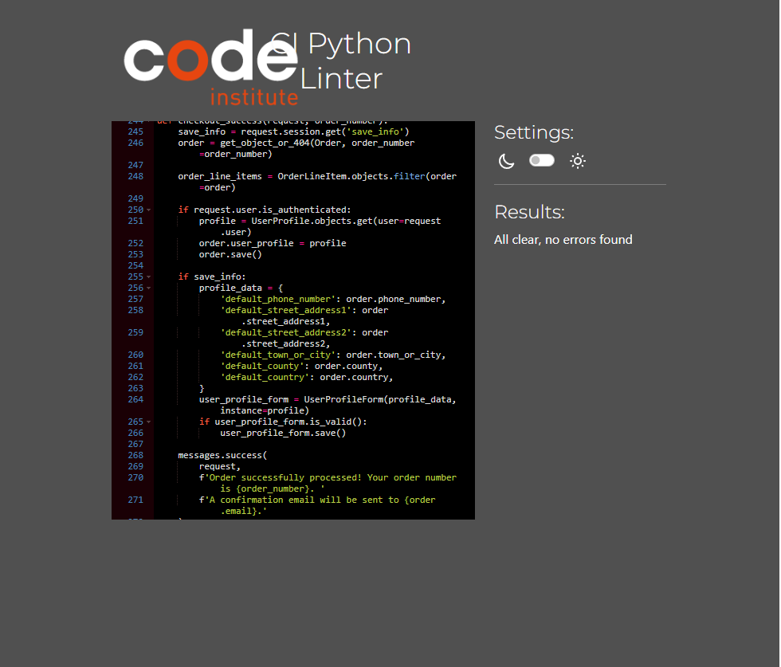

Go back to [README.md](/README.md)

# Testing

- [Code Validation](#code-validation)
  - [HTML](#html)
  - [CSS](#css)
  - [JavaScript](#JavaScript)
  - [Python](#python)
- [Responsiveness](#Responsiveness)
- [Browser Compatibility](#browser-compatibility)
- [Lighthouse](#Lighthouse)
- [CRUD](#crud)
- [Manual Testing](#manual-testing)
- [Automated Testing](#automated-testing)
- [User Story Testing](#user-story-testing)
- [Stripe](#stripe)
- [Bugs](#bugs)

## Code Validation

### HTML

| Page               | Validator                                                                            | Result            | Comment                                         |
| ------------------ | ------------------------------------------------------------------------------------ | ----------------- | ----------------------------------------------- |
| Home               |                         | <mark>PASS<mark>  |                                                 |
| Products           |                     | <mark>PASS<mark>  |                                                 |
| Product Detail     |          | <mark>PASS<mark>  |                                                 |
| Add Product        |                | <mark>PASS<mark>  |                                                 |
| Edit Product       |               | <mark>PASS<mark>  |                                                 |
| Programs           |                     | <mark>PASS<mark>  |                                                 |
| Program Detail     |          | <mark>Error<mark> | Youtube embed issue outdated property           |
| Cart               |                             | <mark>PASS<mark>  |                                                 |
| Checkout           |                     | <mark>PASS<mark>  |                                                 |
| Subscription       |             | <mark>PASS<mark>  |                                                 |
| Profile            |                       | <mark>PASS<mark>  |                                                 |
| Order Confirmation |  | <mark>PASS<mark>  |                                                 |
| My Courses         |                  | <mark>PASS<mark>  |                                                 |
| Logout             |                         | <mark>PASS<mark>  |                                                 |
| Login              |                           | <mark>PASS<mark>  |                                                 |
| Register           |                     | <mark>Error<mark> | Prerendered all auth form - ul within small tag |
| Errors             |                         | <mark>PASS<mark>  |                                                 |
| Privacy            |                        | <mark>PASS<mark>  |                                                 |

### CSS

| File     | Validator                                                       | Result           |
| -------- | --------------------------------------------------------------- | ---------------- |
| Base     |          | <mark>PASS<mark> |
| Program  |   | <mark>PASS<mark> |
| Profile  |   | <mark>PASS<mark> |
| Product  |   | <mark>PASS<mark> |
| Checkout |  | <mark>PASS<mark> |
| Cart     |          | <mark>PASS<mark> |

## JavaScript

| File               | Validator                                                                   | Result           | Comment                          |
| ------------------ | --------------------------------------------------------------------------- | ---------------- | -------------------------------- |
| stripe_elements.js |  | <mark>PASS<mark> | Global variables and es6 enabled |
| mailchimp.js       |              | <mark>PASS<mark> | Global variable errors           |
| toast.js           |                     | <mark>PASS<mark> | Global variables and es6 enabled |

## Python

| File     | App      | Image                                                                     | Result           | Comment                                                             |
| -------- | -------- | ------------------------------------------------------------------------- | ---------------- | ------------------------------------------------------------------- |
| views    | home     |            | <mark>PASS<mark> |                                                                     |
| urls     | home     |              | <mark>PASS<mark> |                                                                     |
| tests    | home     |             | <mark>PASS<mark> |                                                                     |
| views    | products |        | <mark>PASS<mark> |                                                                     |
| utils    | products |        | <mark>PASS<mark> |                                                                     |
| urls     | products |          | <mark>PASS<mark> |                                                                     |
| tests    | products |        | <mark>PASS<mark> |                                                                     |
| models   | products |      | <mark>PASS<mark> |                                                                     |
| admin    | products |        | <mark>PASS<mark> |                                                                     |
| forms    | products |         | <mark>PASS<mark> |                                                                     |
| views    | programs |        | <mark>PASS<mark> |                                                                     |
| urls     | programs |          | <mark>PASS<mark> |                                                                     |
| tests    | programs |        | <mark>PASS<mark> |                                                                     |
| models   | programs |      | <mark>PASS<mark> |                                                                     |
| admin    | programs |        | <mark>PASS<mark> |                                                                     |
| views    | profiles |        | <mark>PASS<mark> |                                                                     |
| urls     | profiles |          | <mark>PASS<mark> |                                                                     |
| tests    | profiles |        | <mark>PASS<mark> |                                                                     |
| models   | profiles |      | <mark>PASS<mark> |                                                                     |
| forms    | profiles |        | <mark>PASS<mark> |                                                                     |
| admin    | profiles |        | <mark>PASS<mark> |                                                                     |
| webhooks | checkout |  | <mark>PASS<mark> | Line too long - code from CI walkthrough on webhook - left unedited |
| handler  | checkout |    | <mark>PASS<mark> |                                                                     |
| view     | checkout |         | <mark>PASS<mark> |                                                                     |
| urls     | checkout |          | <mark>PASS<mark> |                                                                     |
| tests    | checkout |         | <mark>PASS<mark> |                                                                     |
| signals  | checkout |    | <mark>PASS<mark> |                                                                     |
| models   | checkout |      | <mark>PASS<mark> |                                                                     |
| forms    | checkout |        | <mark>PASS<mark> |                                                                     |
| admin    | checkout |        | <mark>PASS<mark> |                                                                     |
| views    | cart     |            | <mark>PASS<mark> |                                                                     |
| utils    | cart     |            | <mark>PASS<mark> |                                                                     |
| urls     | cart     |              | <mark>PASS<mark> |                                                                     |
| tests    | cart     |            | <mark>PASS<mark> |                                                                     |
| context  | cart     |        | <mark>PASS<mark> |                                                                     |

## Responsiveness

The responsiveness of the website was thoroughly tested on various devices, including a MacBook Pro 15-inch, a Huawei P30 Pro, and a 24-inch monitor. Across all devices, the elements displayed cleanly and were well-organized, ensuring a consistent and user-friendly experience.

## Browser Compatibility

| Browser       | Result                                                     | Pass/Fail         |
| ------------- | ---------------------------------------------------------- | ----------------- |
| Google Chrome | All pages, load as expected. All features work as expected | <mark>Pass</mark> |
| Firefox       | All pages, load as expected. All features work as expected | <mark>Pass</mark> |
| Edge          | All pages, load as expected. All features work as expected | <mark>Pass</mark> |
| Safari        | All pages, load as expected. All features work as expected | <mark>Pass</mark> |

## Lighthouse

| Page                   | Validator                                                                                    | Result                 |
| ---------------------- | -------------------------------------------------------------------------------------------- | ---------------------- |
| Home                   |                                   | <mark>Excellent</mark> |
| Home Mobile            |                      | <mark>Good</mark>      |
| Products               |                           | <mark>Excellent</mark> |
| Product Mobile         |              | <mark>Pass</mark>      |
| Product Detail         |                | <mark>Good</mark>      |
| Product Detail Mobile  |   | <mark>Pass</mark>      |
| Add Product            |                      | <mark>Excellent</mark> |
| Add Product Mobile     |         | <mark>Excellent</mark> |
| Edit Product           |                    | <mark>Excellent</mark> |
| Edit Product Mobile    |       | <mark>Excellent</mark> |
| Programs               |                           | <mark>Excellent</mark> |
| Programs Mobile        |              | <mark>Pass</mark>      |
| Programs Detail        |              | <mark>Good</mark>      |
| Programs Detail Mobile |  | <mark>Pass</mark>      |
| Cart                   |                                   | <mark>Good</mark>      |
| Cart Mobile            |                      | <mark>Pass</mark>      |
| Checkout               |                           | <mark>Pass</mark>      |
| Checkout Mobile        |              | <mark>Pass</mark>      |
| Confirmation           |                   | <mark>Excellent</mark> |
| Confirmation Mobile    |      | <mark>Pass</mark>      |
| Subscription           |                  | <mark>Excellent</mark> |
| Subscription Mobile    |     | <mark>Pass</mark>      |
| My courses             |                        | <mark>Excellent</mark> |
| My courses Mobile      |           | <mark>Excellent</mark> |
| My courses Mobile      |           | <mark>Excellent</mark> |

Signficant optimisation practices were used to try and increase the Largest Contentful Paint (LCP)

1. Optimisation of images in webp format
2. Post load all JS to stop blocking script downloads in head
3. Image lazy load below the fold

Main issues that could not be resolved which drastically reduced the LCP and performance score was server delays from Heroku which impacted the first byte load.
After must research I could not find a solution to this issue. I will continue to try optimise and research best practices but for now I need further guidance.

### Heroku Server Delay Issue

## CRUD

The main crud functionality of this website pertains to user accounts and product purchases

### Create

1. Users can create accounts
2. Users can create cart items
3. Users can create orders
4. Admins and Moderators can create products

### Read

1. All products are read from DB
2. All programs are read from DB
3. All subscriptions are read from DB
4. All user orders are read from DB
5. All user information is read from DB

### Update

1. Users can update cart items
2. Users can update user account information
3. Users can update user profile information
4. Users can update subscription status
5. Admins and Moderators can update products

### Delete

1. Users can remove items from cart
2. User can delete thier accounts
3. Admins and Moderators can delete products

## Manual Testing

### Site Navigation

| Element                  | Action      | Expected Result                                         | Pass/Fail         |
| ------------------------ | ----------- | ------------------------------------------------------- | ----------------- |
| Logo                     | Click       | Redirect to Home page                                   | <mark>Pass</mark> |
| Swag Button              | Click       | Render a dropdown menu of all product categories        | <mark>Pass</mark> |
| Swag Dropdown Link       | Click       | Redirect to selected product category page              | <mark>Pass</mark> |
| Courses Button           | Click       | Render a dropdown menu of all program categories        | <mark>Pass</mark> |
| Courses Dropdown Link    | Click       | Redirect to selected program category page              | <mark>Pass</mark> |
| Subscription Link        | Click       | Redirect to subscription page                           | <mark>Pass</mark> |
| Profile Button           | Click       | Render a dropdown menu of all profile sections          | <mark>Pass</mark> |
| Profile Dropdown         | Click       | Redirect to selected page                               | <mark>Pass</mark> |
| Profile Dropdown Link    | Click       | Redirect to selected page                               | <mark>Pass</mark> |
| Profile Dropdown Auth    | Display     | Render logout, profile, courses, add product links      | <mark>Pass</mark> |
| Profile Dropdown NonAuth | Click       | Render login and register links                         | <mark>Pass</mark> |
| Cart Icon Link           | Click       | Redirect to cart page                                   | <mark>Pass</mark> |
| Hamburger Menu           | Click       | Render a dropdown menu of all links                     | <mark>Pass</mark> |
| Footer Socials           | Click       | Redirect in a new tab to all respective media platforms | <mark>Pass</mark> |
| Privacy and Policy Link  | Click       | Redirect to privacy policy page                         | <mark>Pass</mark> |
| About Page               | Click       | Redirect to about page                                  | <mark>Pass</mark> |
| Footer Email             | Click       | Open up an email provider with developer email attached | <mark>Pass</mark> |
| Newsletter Input Valid   | Submit      | User email logged in mailchimp                          | <mark>Pass</mark> |
| Newsletter Input Valid   | Submit      | User notified of success                                | <mark>Pass</mark> |
| Newsletter Input Invalid | Submit      | Error context displayed to UI                           | <mark>Pass</mark> |
| Register Link            | Display     | Render for non authenticated users                      | <mark>Pass</mark> |
| Log in Link              | Display     | Render for non authenticated users                      | <mark>Pass</mark> |
| Log out Link             | Display     | Render only if user is authenticated                    | <mark>Pass</mark> |
| Profile Link             | Display     | Render only if user is authenticated                    | <mark>Pass</mark> |
| Nav Link                 | Hover/Focus | Darken colour of text                                   | <mark>Pass</mark> |
| Footer Socials           | Hover/Focus | Provide background colour feedback change               | <mark>Pass</mark> |

### Home Page

| Element            | Action | Expected Result                           | Pass/Fail         |
| ------------------ | ------ | ----------------------------------------- | ----------------- |
| Shop Now Button    | Click  | Redirect to selected product page         | <mark>Pass</mark> |
| Buy Courses Button | Click  | Redirect to selected programs page        | <mark>Pass</mark> |
| Carousel Arrow     | Click  | Navigate to next slide based on direction | <mark>Pass</mark> |
| Carousel Button    | Click  | Navigate to next slide based on number    | <mark>Pass</mark> |
| Membership Link    | Click  | Redirect to Subscription page             | <mark>Pass</mark> |

### Product Page

| Element                  | Action      | Expected Result                                                 | Pass/Fail         |
| ------------------------ | ----------- | --------------------------------------------------------------- | ----------------- |
| Category Widgets         | Click       | Redirect to selected product category page                      | <mark>Pass</mark> |
| Filter By Price Button   | Click       | Filter queried products based on price                          | <mark>Pass</mark> |
| Filter By Rating Button  | Click       | Filter queried products based on rating                         | <mark>Pass</mark> |
| Filter By Sale Button    | Click       | Filter queried products based on sale                           | <mark>Pass</mark> |
| Filter Direction         | Display     | Filter direction displayed via an arrow                         | <mark>Pass</mark> |
| Current Category         | Display     | Current displayed category is shown in the header               | <mark>Pass</mark> |
| Search Bar               | Search      | Filter products based on query to category, name or description | <mark>Pass</mark> |
| Product Cards            | Display     | All filtered Product Cards Rendered in grid layout              | <mark>Pass</mark> |
| Product View Card Button | Click       | Redirect to product detail page                                 | <mark>Pass</mark> |
| Product Edit Button      | Display     | Only moderators and admins can see this button                  | <mark>Pass</mark> |
| Product Edit Button      | Click       | Redirect to edit product page                                   | <mark>Pass</mark> |
| Product View Card Button | Hover/Focus | Background darkens, text lightens                               | <mark>Pass</mark> |
| Product Edit Button      | Hover/Focus | Background darkens                                              | <mark>Pass</mark> |
| Filter Button            | Hover/Focus | Background darkens                                              | <mark>Pass</mark> |
| Search Icon              | Hover/Focus | Background darkens                                              | <mark>Pass</mark> |
| Category Widgets         | Hover/Focus | Background turns orange, text turns white                       | <mark>Pass</mark> |

### Product Detail Page

| Element             | Action      | Expected Result                                                  | Pass/Fail         |
| ------------------- | ----------- | ---------------------------------------------------------------- | ----------------- |
| Quantity Input      | Input       | Updates the total amount of desired product - no negative values | <mark>Pass</mark> |
| Add to Cart Button  | Click       | Total quantity of item added to cart                             | <mark>Pass</mark> |
| Add to Cart Button  | Click       | Notification appears upon outcome of adding to cart              | <mark>Pass</mark> |
| Product Edit Button | Display     | Only moderators and admins can see this button                   | <mark>Pass</mark> |
| Product Edit Button | Click       | Redirect to edit product page                                    | <mark>Pass</mark> |
| Back Link           | Click       | Redirects back to the products page                              | <mark>Pass</mark> |
| Paginator           | Click       | All navigations buttons redirect to correct paginated results    | <mark>Pass</mark> |
| View Product Button | Click       | Redirect to related product detail page                          | <mark>Pass</mark> |
| Related Products    | Display     | Display product cards of 4 related items with pagination         | <mark>Pass</mark> |
| Back Link           | Hover/Focus | Text darkens                                                     | <mark>Pass</mark> |
| Add to Cart Button  | Hover/Focus | Background darkens, text lightens                                | <mark>Pass</mark> |
| Product Edit Button | Hover/Focus | Background darkens                                               | <mark>Pass</mark> |
| Paginator Button    | Hover/Focus | Background darkens                                               | <mark>Pass</mark> |

### Add Product Page

| Element            | Action      | Expected Result                                | Pass/Fail         |
| ------------------ | ----------- | ---------------------------------------------- | ----------------- |
| Authentication     | Display     | Only Moderators and Admins can access the page | <mark>Pass</mark> |
| Form               | Display     | A form is rendered with all fields editable    | <mark>Pass</mark> |
| Form               | Display     | Required fields are clearly marked             | <mark>Pass</mark> |
| Form Valid         | Submit      | A a product is saved to the database           | <mark>Pass</mark> |
| Form Valid         | Submit      | User is redirected to the products page        | <mark>Pass</mark> |
| Form Valid         | Submit      | A notification displays the success message    | <mark>Pass</mark> |
| Form Invalid       | Submit      | Error context is rendered to the UI            | <mark>Pass</mark> |
| Form Invalid       | Submit      | A notification display an error occured        | <mark>Pass</mark> |
| Form Invalid       | Submit      | User is redirected to the add product page     | <mark>Pass</mark> |
| Products Link      | Click       | Navigate to products page                      | <mark>Pass</mark> |
| Products Link      | Hover/Focus | Darkens text                                   | <mark>Pass</mark> |
| Form Image Button  | Hover/Focus | Darkens background                             | <mark>Pass</mark> |
| Form Submit Button | Hover/Focus | Darkens background                             | <mark>Pass</mark> |

### Edit Product Page

| Element             | Action      | Expected Result                                           | Pass/Fail         |
| ------------------- | ----------- | --------------------------------------------------------- | ----------------- |
| Tests Add Products  | All         | All validation and display context from add products pass | <mark>Pass</mark> |
| Form                | Display     | Product data is pre rendered to the page                  | <mark>Pass</mark> |
| Form                | Display     | Product data is pre rendered to the page                  | <mark>Pass</mark> |
| Current Image       | Display     | Link to current image displayed                           | <mark>Pass</mark> |
| Current Image Clear | Checked     | Image is removed from the product                         | <mark>Pass</mark> |
| Current Image Clear | Checked     | Image is removed from the product                         | <mark>Pass</mark> |
| Form Update Button  | Click       | Form is submitted                                         | <mark>Pass</mark> |
| Form Delete Button  | Click       | Confirmation modal appears                                | <mark>Pass</mark> |
| Modal Delete Button | Click       | Product is removed from the database                      | <mark>Pass</mark> |
| Modal Delete Button | Click       | User is redirected to the products page                   | <mark>Pass</mark> |
| Modal Delete Button | Click       | A notification message is displayed to user               | <mark>Pass</mark> |
| Modal Cancel Button | Click       | Modal is hidden                                           | <mark>Pass</mark> |
| Products Link       | Click       | Navigate to products page                                 | <mark>Pass</mark> |
| Products Link       | Hover/Focus | Darkens text                                              | <mark>Pass</mark> |
| Form Update Button  | Hover/Focus | Darkens background                                        | <mark>Pass</mark> |
| Form Delete Button  | Hover/Focus | Darkens background                                        | <mark>Pass</mark> |

### Program Page

| Element                 | Action      | Expected Result                                                 | Pass/Fail         |
| ----------------------- | ----------- | --------------------------------------------------------------- | ----------------- |
| Category Widgets        | Click       | Redirect to selected program category page                      | <mark>Pass</mark> |
| Filter By Price Button  | Click       | Filter queried programs based on price                          | <mark>Pass</mark> |
| Filter By Rating Button | Click       | Filter queried programs based on rating                         | <mark>Pass</mark> |
| Filter By Sale Button   | Click       | Filter queried programs based on sale                           | <mark>Pass</mark> |
| Filter Direction        | Display     | Filter direction displayed via an arrow                         | <mark>Pass</mark> |
| Current Category        | Display     | Current displayed category is shown in the header               | <mark>Pass</mark> |
| Search Bar              | Search      | Filter programs based on query to category, name or description | <mark>Pass</mark> |
| Program Cards           | Display     | All filtered program Cards Rendered in grid layout              | <mark>Pass</mark> |
| Program Card            | Click       | Redirect to program detail page                                 | <mark>Pass</mark> |
| Product Card            | Hover/Focus | Border outline turns blue, cursor is a pointer                  | <mark>Pass</mark> |
| Filter Button           | Hover/Focus | Background darkens                                              | <mark>Pass</mark> |
| Search Icon             | Hover/Focus | Background darkens                                              | <mark>Pass</mark> |
| Category Widgets        | Hover/Focus | Background turns orange, text turns white                       | <mark>Pass</mark> |

### Program Detail Page

| Element                  | Action      | Expected Result                                                | Pass/Fail         |
| ------------------------ | ----------- | -------------------------------------------------------------- | ----------------- |
| Enroll Button            | Click       | Adds course to cart                                            | <mark>Pass</mark> |
| Remove from Cart Button  | Click       | Removes course from cart                                       | <mark>Pass</mark> |
| Login to Enroll          | Click       | Redirects to login page                                        | <mark>Pass</mark> |
| Enrolled Button          | Click       | Button is disabled if already enrolled                         | <mark>Pass</mark> |
| Add / Remove Cart Button | Click       | Notification appears upon outcome of adding/removing from cart | <mark>Pass</mark> |
| Module Accordion         | Click       | Display hidden text and rotate arrow                           | <mark>Pass</mark> |
| Back Link                | Click       | Redirects back to the programs page                            | <mark>Pass</mark> |
| Paginator                | Click       | All navigations buttons redirect to correct paginated results  | <mark>Pass</mark> |
| View Product Button      | Click       | Redirect to related program detail page                        | <mark>Pass</mark> |
| Related Products         | Display     | Display program cards of 4 related items with pagination       | <mark>Pass</mark> |
| Video                    | Display     | Display Video if course is purchased in orders                 | <mark>Pass</mark> |
| Enrolled Button          | Display     | Display Enrolled grey button if course is purchased            | <mark>Pass</mark> |
| Back Link                | Hover/Focus | Text darkens                                                   | <mark>Pass</mark> |
| Add to Cart Button       | Hover/Focus | Background darkens, text lightens                              | <mark>Pass</mark> |
| Remove from Cart Button  | Hover/Focus | Background darkens, text lightens                              | <mark>Pass</mark> |
| Login to Enroll          | Hover/Focus | Background darkens, text lightens                              | <mark>Pass</mark> |
| Paginator Button         | Hover/Focus | Background darkens                                             | <mark>Pass</mark> |

### Subscription Page

| Element                     | Action      | Expected Result                                                | Pass/Fail         |
| --------------------------- | ----------- | -------------------------------------------------------------- | ----------------- |
| Subscribe Button            | Click       | Adds subscription to cart                                      | <mark>Pass</mark> |
| Subscribe Button            | Click       | If subscription is already in cart it is replaced              | <mark>Pass</mark> |
| Remove Subscription Button  | Click       | A confirmation modal is displayed                              | <mark>Pass</mark> |
| Remove Subscription Confirm | Click       | Current active subscription is removed                         | <mark>Pass</mark> |
| Add / Remove Cart Button    | Click       | Notification appears upon outcome of adding/removing from cart | <mark>Pass</mark> |
| Non authenticated users     | Visit       | Redirected to Login page                                       | <mark>Pass</mark> |
| Remove Subscription Button  | Display     | If already subscribed remove button rendered and card is grey  | <mark>Pass</mark> |
| Subscription status         | Display     | Current subscription noticed in subheading                     | <mark>Pass</mark> |
| Subscribe Button            | Hover/Focus | Text darkens, border darkens                                   | <mark>Pass</mark> |

### Cart Page

| Element                     | Action      | Expected Result                                                | Pass/Fail         |
| --------------------------- | ----------- | -------------------------------------------------------------- | ----------------- |
| Update Cart Button          | Click       | Updates the quantity of product by desired amount              | <mark>Pass</mark> |
| Remove from Cart Button     | Click       | Removes all quantity of selected item from cart                | <mark>Pass</mark> |
| Remove Subscription Button  | Click       | A confirmation modal is displayed                              | <mark>Pass</mark> |
| Remove Subscription Confirm | Click       | Current active subscription is removed                         | <mark>Pass</mark> |
| Add / Remove Cart Button    | Click       | Notification appears upon outcome of adding/removing from cart | <mark>Pass</mark> |
| Checkout Button             | Click       | Redirects to checkout page                                     | <mark>Pass</mark> |
| Continue Shopping Link      | Click       | Redirects to products page                                     | <mark>Pass</mark> |
| Update Cart Button          | Display     | Only available for products                                    | <mark>Pass</mark> |
| Discounts                   | Display     | All added discounts are displayed (sale, membership)           | <mark>Pass</mark> |
| Total Cost                  | Display     | Total cost is accurately displayed with breakdown              | <mark>Pass</mark> |
| Update Cart Button          | Hover/Focus | Background darkens, text darkens                               | <mark>Pass</mark> |
| Remove from cart Button     | Hover/Focus | Background darkens, text darkens                               | <mark>Pass</mark> |
| Checkout Button             | Hover/Focus | Background darkens                                             | <mark>Pass</mark> |
| Continue Shopping Link      | Hover/Focus | Text darkens                                                   | <mark>Pass</mark> |

### Checkout Page

| Element                    | Action      | Expected Result                                            | Pass/Fail         |
| -------------------------- | ----------- | ---------------------------------------------------------- | ----------------- |
| Checkout No Items          | Display     | Redirect to cart page with noti                            | <mark>Pass</mark> |
| Checkout Form              | Submit      | Checkout form submit user and delivery data to stripe      | <mark>Pass</mark> |
| Checkout Form              | Submit      | Stripe payment intent, charge and succeeded occurs         | <mark>Pass</mark> |
| Checkout Form              | Submit      | Non valid form returns context of errors                   | <mark>Pass</mark> |
| Checkout Form              | Submit      | Successful order redirects to checkout success page        | <mark>Pass</mark> |
| Checkout Form              | Submit      | Stripe webhooks are logged via stripe listeners            | <mark>Pass</mark> |
| Checkout Form Save Details | Submit      | Authenticated users details are saved if button is checked | <mark>Pass</mark> |
| Stripe Payment Element     | Submit      | Stripe payment element renders error context if not valid  | <mark>Pass</mark> |
| Pay Now Button             | Click       | Submits user/delivery/payment information                  | <mark>Pass</mark> |
| Continue Shopping Link     | Click       | Redirects to products page                                 | <mark>Pass</mark> |
| Remove from Cart Button    | Click       | Removes all quantity of selected item from cart            | <mark>Pass</mark> |
| Loading Spinner            | Display     | A loading spinner is displayed when await payment results  | <mark>Pass</mark> |
| Cart Items                 | Display     | All Cart items are displayed with a price breakdown        | <mark>Pass</mark> |
| Total Cost                 | Display     | The total cost is accounted for for a price breakdown      | <mark>Pass</mark> |
| Pay Now Button             | Hover/Focus | Background darkens                                         | <mark>Pass</mark> |
| Checkout Form Save Details | Checked     | Background darkens                                         | <mark>Pass</mark> |

### Checkout Success/ Past Order Page

| Element       | Action  | Expected Result                                                     | Pass/Fail         |
| ------------- | ------- | ------------------------------------------------------------------- | ----------------- |
| Checkout Form | Display | Checkout form rendered all Order information, price, user, delivery | <mark>Pass</mark> |
| Checkout Form | Display | Total cost breakdown is displayed for the user                      | <mark>Pass</mark> |
| Notification  | Display | A Notification appears highlighting the successful order number     | <mark>Pass</mark> |

### Profile Page

| Element                | Action      | Expected Result                                                  | Pass/Fail         |
| ---------------------- | ----------- | ---------------------------------------------------------------- | ----------------- |
| User Form              | Submit      | A valid user form updates the users first/last name and username | <mark>Pass</mark> |
| User Form              | Submit      | Non valid form returns the context of the error                  | <mark>Pass</mark> |
| User Notification      | Submit      | A Notification appears highlighting outcome of form submission   | <mark>Pass</mark> |
| Delivery Form          | Submit      | A valid form updates the user delivery information               | <mark>Pass</mark> |
| Delivery Form          | Submit      | Non valid form returns the context of the error                  | <mark>Pass</mark> |
| Delivery Notification  | Submit      | A Notification appears highlighting outcome of form submission   | <mark>Pass</mark> |
| Delete Account Button  | Click       | A confirmation modal appears warning the user of the action      | <mark>Pass</mark> |
| Delete Account Confirm | Click       | The user account is deleted from the database                    | <mark>Pass</mark> |
| Delete Account Confirm | Click       | A notification informs the user of the outcome of the operation  | <mark>Pass</mark> |
| Checkout Form          | Display     | Total cost breakdown is displayed for the user                   | <mark>Pass</mark> |
| Update Profile Button  | Click       | Submits the user form                                            | <mark>Pass</mark> |
| Update Delivery Button | Click       | Submits the user profile form for delivery information           | <mark>Pass</mark> |
| Past Order Link        | Click       | Redirects the user to the checkout success page / past order     | <mark>Pass</mark> |
| Past Orders            | Display     | Renders all authenticated users past orders                      | <mark>Pass</mark> |
| Update Profile Button  | Hover/Focus | Background darkens                                               | <mark>Pass</mark> |
| Update Delivery Button | Hover/Focus | Background darkens                                               | <mark>Pass</mark> |
| Past Order             | Hover/Focus | Text darkens                                                     | <mark>Pass</mark> |

### My Courses Page

| Element                | Action      | Expected Result                                    | Pass/Fail         |
| ---------------------- | ----------- | -------------------------------------------------- | ----------------- |
| Program Cards          | Display     | All enrolled program Cards Rendered in grid layout | <mark>Pass</mark> |
| Explore Courses Button | Click       | Redirect to programs page                          | <mark>Pass</mark> |
| Explore Courses Button | Display     | No Courses associated with user                    | <mark>Pass</mark> |
| Program Card           | Click       | Redirect to program detail page                    | <mark>Pass</mark> |
| Product Card           | Hover/Focus | Border outline turns blue, cursor is a pointer     | <mark>Pass</mark> |
| Explore Courses Button | Click       | Background darkens                                 | <mark>Pass</mark> |

### Sign Up Page

| Element       | Action         | Expected Result                             | Pass/Fail         |
| ------------- | -------------- | ------------------------------------------- | ----------------- |
| Page          | Authentication | Authenticated users redirected to Home page | <mark>Pass</mark> |
| Form(Valid)   | Submit         | Redirected to Home page                     | <mark>Pass</mark> |
| Form(Valid)   | Submit         | Sign up in Notification received            | <mark>Pass</mark> |
| Form(Invalid) | Submit         | Error Context rendered to UI                | <mark>Pass</mark> |
| Form(Invalid) | Submit         | Error Notification received                 | <mark>Pass</mark> |
| Login Link    | Click          | Redirect to Login Page                      | <mark>Pass</mark> |
| Form Button   | Hover/Focus    | Darken Background                           | <mark>Pass</mark> |
| Login Link    | Hover/Focus    | Darken Text                                 | <mark>Pass</mark> |

### Sign In Page

| Element              | Action         | Expected Result                             | Pass/Fail         |
| -------------------- | -------------- | ------------------------------------------- | ----------------- |
| Page                 | Authentication | Authenticated users redirected to Home page | <mark>Pass</mark> |
| Form(Valid)          | Submit         | Redirected to Home page                     | <mark>Pass</mark> |
| Form(Valid)          | Submit         | Sign up in Notification received            | <mark>Pass</mark> |
| Form(Invalid)        | Submit         | Error Context rendered to UI                | <mark>Pass</mark> |
| Form(Invalid)        | Submit         | Error Notification received                 | <mark>Pass</mark> |
| Register Link        | Click          | Redirect to Sign In Page                    | <mark>Pass</mark> |
| Forgot Password Link | Click          | Redirect to Password Reset Page             | <mark>Pass</mark> |
| Form Button          | Hover/Focus    | Darken Background                           | <mark>Pass</mark> |
| Register Link        | Hover/Focus    | Darken Text                                 | <mark>Pass</mark> |
| Forgot Password Link | Hover/Focus    | Darken Text                                 | <mark>Pass</mark> |

### Log Out Page

| Element       | Action         | Expected Result                                | Pass/Fail         |
| ------------- | -------------- | ---------------------------------------------- | ----------------- |
| Page          | Authentication | Un-authenticated users redirected to Home page | <mark>Pass</mark> |
| Logout Button | Click          | User session is Logged out                     | <mark>Pass</mark> |
| Logout Button | Click          | Redirected to Home page                        | <mark>Pass</mark> |
| Form Button   | Hover/Focus    | Darken Background                              | <mark>Pass</mark> |

### Password Reset Page

| Element           | Action      | Expected Result                                   | Pass/Fail         |
| ----------------- | ----------- | ------------------------------------------------- | ----------------- |
| Email Input Valid | Submit      | Sends An Email with a reset link to entered email | <mark>Pass</mark> |
| Login Button      | Click       | Redirects to login page                           | <mark>Pass</mark> |
| Reset Button      | Click       | Sends An Email with a reset link to entered email | <mark>Pass</mark> |
| Login Button      | Hover/Focus | Darken Background                                 | <mark>Pass</mark> |
| Reset Button      | Hover/Focus | Darken Background                                 | <mark>Pass</mark> |

### Password Reset Email

| Element    | Action | Expected Result                                   | Pass/Fail         |
| ---------- | ------ | ------------------------------------------------- | ----------------- |
| Email Link | Submit | Link directs the user to the password change form | <mark>Pass</mark> |

### Password Change Page

| Element       | Action      | Expected Result                       | Pass/Fail         |
| ------------- | ----------- | ------------------------------------- | ----------------- |
| Form Valid    | Submit      | Updates the users password            | <mark>Pass</mark> |
| Form Valid    | Submit      | Redirects to password updated page    | <mark>Pass</mark> |
| Form(Valid)   | Submit      | Change Password Notification received | <mark>Pass</mark> |
| Form(Invalid) | Submit      | Error Notification received           | <mark>Pass</mark> |
| Form Invalid  | Submit      | Renders the error context to the user | <mark>Pass</mark> |
| Reset Button  | Click       | Updates the users password            | <mark>Pass</mark> |
| Reset Button  | Hover/Focus | Darken Background                     | <mark>Pass</mark> |

### Django Administration Panel

| Element            | Action | Expected Result                           | Pass/Fail         |
| ------------------ | ------ | ----------------------------------------- | ----------------- |
| Product Model      | Create | Admins can create new products            | <mark>Pass</mark> |
| Program Model      | Create | Admins can create new programs            | <mark>Pass</mark> |
| Subscription Model | Create | Admins can create new subscriptions       | <mark>Pass</mark> |
| Module Model       | Create | Admins can create new modules             | <mark>Pass</mark> |
| Category Model     | Create | Admins can create new Categories          | <mark>Pass</mark> |
| Order Model        | Create | Admins can create new Orders              | <mark>Pass</mark> |
| Product Model      | Update | Admins can update exisiting products      | <mark>Pass</mark> |
| Program Model      | Update | Admins can update exisiting programs      | <mark>Pass</mark> |
| Subscription Model | Update | Admins can update exisiting subscriptions | <mark>Pass</mark> |
| Module Model       | Update | Admins can update exisiting modules       | <mark>Pass</mark> |
| Category Model     | Update | Admins can update exisiting Categories    | <mark>Pass</mark> |
| Order Model        | Update | Admins can update exisiting Orders        | <mark>Pass</mark> |
| Product Model      | Delete | Admins can delete exisiting products      | <mark>Pass</mark> |
| Program Model      | Delete | Admins can delete exisiting programs      | <mark>Pass</mark> |
| Subscription Model | Delete | Admins can delete exisiting subscriptions | <mark>Pass</mark> |
| Module Model       | Delete | Admins can delete exisiting modules       | <mark>Pass</mark> |
| Category Model     | Delete | Admins can delete exisiting Categories    | <mark>Pass</mark> |
| Order Model        | Delete | Admins can delete exisiting Orders        | <mark>Pass</mark> |

## Automated testing

Automated testing was conducted to verify the accuracy of the page responses and templates. However, due to time constraints, there was no opportunity for further elaboration or expansion. Future features include full automated test coverage.

All automated tests are documented in test.py files and pass without error.

## User Story Testing

| User Story                                                                                                                                                                                             | Screenshot                                                                                                                  | Result           |
| ------------------------------------------------------------------------------------------------------------------------------------------------------------------------------------------------------ | --------------------------------------------------------------------------------------------------------------------------- | ---------------- |
| As a developer I can setup a new Django project so that I can create the project's structure                                                                                                           | The project was set up successfully                                                                                         | <mark>PASS<mark> |
| As a developer, I can perform an early deployment of the application to verify the functionality of the initial setup so that I can continue testing the application as it evolves during development. | The application was deployed after the initial set up to confirm everything is working as expected                          | <mark>PASS<mark> |
| As a developer I can connect database, static/media storage and stripe payments so that data is accessible on deployment and payments are configured early                                             | The application was linked to AWS, Stripe And Elephant SQL. All required services are linked                                | <mark>PASS<mark> |
| As a developer I can choose a colour theme so that all pages have a consistent feel and style.                                                                                                         | A colour theme was selected for the website                                                                                 | <mark>PASS<mark> |
| As a developer I can layout wireframes so that I have a clear idea of the sites structure and theme                                                                                                    | Wireframes created and referenced throughout site layout                                                                    | <mark>PASS<mark> |
| As a User I can intuitively navigate through the website so that I can view all content with ease.                                                                                                     | 

Navigation Bar

                  | <mark>PASS<mark> |
| As a Developer, I want to ensure the styling and theme of the website are consistent with intuitive UI/UX so that users easily digest content and perform all actions with ease.                       | All elements across all pages are responsive to multiple devices and screensizes                                            | <mark>PASS<mark> |
| As a developer, I can plan out multiple apps that have clear separation of function so that a larger scale project can be broken down into smaller modules                                             | Main application seperated into modular apps for clear functional seperation                                                | <mark>PASS<mark> |
| As a developer, I can create data model classes for products so that structure my data effectively develop relationships between each type                                                             | Product Model clearly structured with effective relationships                                                               | <mark>PASS<mark> |
| As a developer, I can create data model classes for programs so that structure my data effectively develop relationships between each type                                                             | Program Model clearly structured with effective relationships                                                               | <mark>PASS<mark> |
| As a developer, I can create data model classes for subscriptions so that structure my data effectively develop relationships between each type                                                        | Subscription Model clearly structured with effective relationships                                                          | <mark>PASS<mark> |
| As a developer, I can create data model classes for profile so that structure my data effectively develop relationships between each type                                                              | Profile Model clearly structured with effective relationships                                                               | <mark>PASS<mark> |
| As a developer, I can create data model classes for orders so that structure my data effectively develop relationships between each type                                                               | Order Model clearly structured with effective relationships                                                                 | <mark>PASS<mark> |
| As a site owner, I can see all my models and data through an admin portal so I can effectively manage my data through CRUD requests                                                                    | Administration classes all registered with full CRUD capabilities                                                           | <mark>PASS<mark> |
| As a User, I can create or login into my account so that I can retrieve my preexisting secure data                                                                                                     | 

Login Form

                | <mark>PASS<mark> |
| As a User, I can log out so that I can secure my account from other users                                                                                                                              | 

Log Out

                         | <mark>PASS<mark> |
| As a developer, I can create mock data so that the final application has products, programs and other required models immediately created                                                              | Fixture files and json files created to quickly populate mock data                                                          | <mark>PASS<mark> |
| As a developer, I can have a base template so that all other templates can inherit from it and keep consistant theming                                                                                 | Base template designed, contains relevant links and scripts and is the root inheritance for all subsequent templates        | <mark>PASS<mark> |
| As a User, I can visit the home page so that I can get a understanding of what the website content is about and navigate through                                                                       | 

Home Page

                     | <mark>PASS<mark> |
| As a developer, I can create data model classes for categories so that structure my data effectively develop relationships between each type                                                           | Category Model clearly structured with effective relationships                                                              | <mark>PASS<mark> |
| As a User, I can visit the product page so that I can view all products available to purchase                                                                                                          | 

Product Page

              | <mark>PASS<mark> |
| As a User, I can see standardised product preview card, providing key information at a glance so I can quickly make a decision                                                                         | 

Product Preview Card

       | <mark>PASS<mark> |
| As a User, I can visit the product detail page so that I can get more information on the product and add it to my card                                                                                 | 

Product Detail Page

      | <mark>PASS<mark> |
| As a User, I can use a search bar to narrow down search results so that I can quickly find products/programs tailored to me                                                                            | 

Search Bar

                   | <mark>PASS<mark> |
| As a User, I can visit the program page so that I can view all program available to enroll in                                                                                                          | 

Programs Page

             | <mark>PASS<mark> |
| As a User, I can visit the program detail page so that I can get more information on the program and add it to my cart in                                                                              | 

Program Detail Page

      | <mark>PASS<mark> |
| As a User, I can see standardised program preview card, providing key information at a glance so I can quickly make a decision                                                                         | 

Program Card

               | <mark>PASS<mark> |
| As a User, I can add and remove items from my shopping cart so that I can manage my purchases easily and efficiently.                                                                                  | 

Update Cart

                 | <mark>PASS<mark> |
| As a User, I can view detailed information about items in my shopping cart on the cart detail page, so that I can review my items before proceeding to checkout.                                       | 

Cart Page

                     | <mark>PASS<mark> |
| As a User, I can easily identify and interact with individual items in my shopping cart through standardised cart item cards, so that I can quickly review and manage my selections.                   | 

Cart Card

                     | <mark>PASS<mark> |
| As a User, I can receive notification messages whenever a CRUD (Create, Read, Update, Delete) action is taken, so that I am informed about the outcome of my actions and any relevant changes.         | 

Notifications

            | <mark>PASS<mark> |
| As a User, I can visit the subscription page so that I can view all subscriptions available                                                                                                            | 

Subscriptions

            | <mark>PASS<mark> |
| As a User, I can view a checkout page so that I can get a run down of items and my total charge                                                                                                        | 

Subscriptions

             | <mark>PASS<mark> |
| As a developer, I can view and manage line items within orders to track my purchase accurately and efficiently.                                                                                        | Line items are editable with adding products to orders from backend. Only certain desired fields                            | <mark>PASS<mark> |
| As a User, I can securely process my order based on the checkout so that I can buy products from the store                                                                                             | 

Checkout

                  | <mark>PASS<mark> |
| As a Developer, I can securely complete my payment using Stripe integration with webhooks, ensuring that my transaction is protected and verified.                                                     | 

Checkout

                       | <mark>PASS<mark> |
| As a User, I can get sales and member discounts so that I can get items at a better price                                                                                                              | 

Discounts

                    | <mark>PASS<mark> |
| As a User, I can remove my active membership so that I can opt out of payments                                                                                                                         | 

Remove Membership

         | <mark>PASS<mark> |
| As a User, I can visit a profile page so that I can view my personal details and update them                                                                                                           | 

Profile Page

               | <mark>PASS<mark> |
| As a User, I can view my past orders on the profile page so that I can track my purchase history and review previous transactions.                                                                     | 

Profile Page

               | <mark>PASS<mark> |
| As a User, I can view the order confirmation page to see the details of my recent order so that I can verify the items purchased and their prices.                                                     | 

Checkout Success

       | <mark>PASS<mark> |
| As a User, I can access a my courses page where I can view all the courses I have bought or enrolled in, so that I can easily track my learning progress and access course materials.                  | 

My Courses

                   | <mark>PASS<mark> |
| As a User, I want to receive a confirmation email after registering for an account, so that I can verify my email address and activate my account.                                                     | 

Checkout

             | <mark>PASS<mark> |
| As a User, I can receive an order confirmation emails after successfully completing a purchase, so that I have a record of the transaction and can review the details of my order.                     | 

Checkout

        | <mark>PASS<mark> |
| As a User, I can see a loading spinner so that I know my actions were registered and a result in pending                                                                                               | 

Loading Spinner

                | <mark>PASS<mark> |
| As a User, I can see my current membership level so that I know what discounts I can avail                                                                                                             | 

Current Membership

of | <mark>PASS<mark> |
| As a User, I can access a short video on the program page if I am enrolled in a course, so that I can get a mock studying experience.                                                                  | 

Enrolled Video

of          | <mark>PASS<mark> |
| As a User, I can discover related products and programs on the program page, so that I can explore additional resources or offerings that complement my current selection.                             | 

Related products

          | <mark>PASS<mark> |
| As a User, I can see error pages (such as 400, 403, 404, 500) so that I am informed and guided appropriately when unexpected issues arise during my interaction with the website.                      | 

Error Page

                   | <mark>PASS<mark> |
| As a User, I can access the Privacy Policy page so that I understand how my personal information is collected, used, and protected.                                                                    | 

Privacy Policy Page

  | <mark>PASS<mark> |
| As a User, I can sign up for the newsletter so that I stay updated with the latest news and offerings                                                                                                  | 

Newsletter

                  | <mark>PASS<mark> |
| As a developer, I can ensure that all code is thoroughly documented with comments in a standardised format so that anyone reading the code can easily understand its purpose.                          | All custom code is commented and documented                                                                                 | <mark>PASS<mark> |
| As a User, I can reset my password if I forget it, so that I can regain access to my account.                                                                                                          | 

Password Reset

           | <mark>PASS<mark> |
| As a User, I can delete my account so that my personal information and data are removed from the website                                                                                               | 

Delete Account

         | <mark>PASS<mark> |
| As a Moderator User, I can update product information but do not have administration access, so ensure product information is accurate                                                                 | 

Moderator

                  | <mark>PASS<mark> |
| As a Moderator or Superuser, I can manage products by adding, editing, and deleting so that I can keep business inventory up to date.                                                                  | 

Add/Edit Product

           | <mark>PASS<mark> |

## Stripe

- Payment Element

- Stripe webhooks

- Stripe Events/Payments

## Bugs

Two bugs were left unhandled. Reasons are documented. Issues will take too much time and can lead to large restructuring of codebase. Noted for fix in future editions of website.

| Bug                                                                                                      | Status |
| -------------------------------------------------------------------------------------------------------- | ------ |
| [Bug: Negative Products #52](https://github.com/DarrachBarneveld/ci-swag/issues/52)                      | Closed |
| [Bug: Adding Generic Items To Cart #59](https://github.com/DarrachBarneveld/ci-swag/issues/59)           | Closed |
| [Bug: Checkout Form Error Context #60](https://github.com/DarrachBarneveld/ci-swag/issues/60)            | Closed |
| [Bug: PhoneNumber Order Widget #63](https://github.com/DarrachBarneveld/ci-swag/issues/63)               | Closed |
| [Bug: Stripe Autofill #66](https://github.com/DarrachBarneveld/ci-swag/issues/66)                        | Closed |
| [Bug: Form Accessibiliy #67](https://github.com/DarrachBarneveld/ci-swag/issues/67)                      | Closed |
| [Bug: Form Accessibiliy #67](https://github.com/DarrachBarneveld/ci-swag/issues/67)                      | Closed |
| [Bug: LCP Page Performance #70](https://github.com/DarrachBarneveld/ci-swag/issues/70)                   | Open   |
| [Bug: Stripe WH Order Creation #75](https://github.com/DarrachBarneveld/ci-swag/issues/75)               | Closed |
| [Bug: Stripe WH fires on invalid order error #76](https://github.com/DarrachBarneveld/ci-swag/issues/76) | Closed |
| [Bug: No Update Quantity On Added Products #80](https://github.com/DarrachBarneveld/ci-swag/issues/80)   | Closed |
| [Bug: Query newly added product #81](https://github.com/DarrachBarneveld/ci-swag/issues/81)              | Open   |
| [Bug: Message Overlay #82](https://github.com/DarrachBarneveld/ci-swag/issues/82)                        | Open   |

### Bug Comments

Issue number [76](<(https://github.com/DarrachBarneveld/ci-swag/issues/76)>) was the largest and most difficult issue I encountered. My solution is not fool proof as stated in the issue card comments but as it was related to the course walkthrough I couldnt find signficant support to help me resolve this issue. I tried my very best to provide a solution that was error free and and mimimal security errors.

Minor bugs left unfixed for future features. Documented.

### Noteable issues

When purchasing the senior dev subscription you can add all courses to cart. This means even upon cancellation of the monthly subscription the courses will still be available which is a hack. All courses should have a payment attached to them in a future feature.
